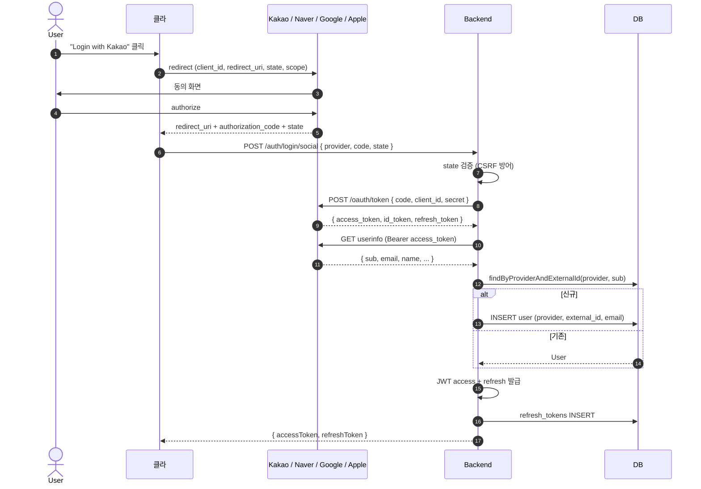
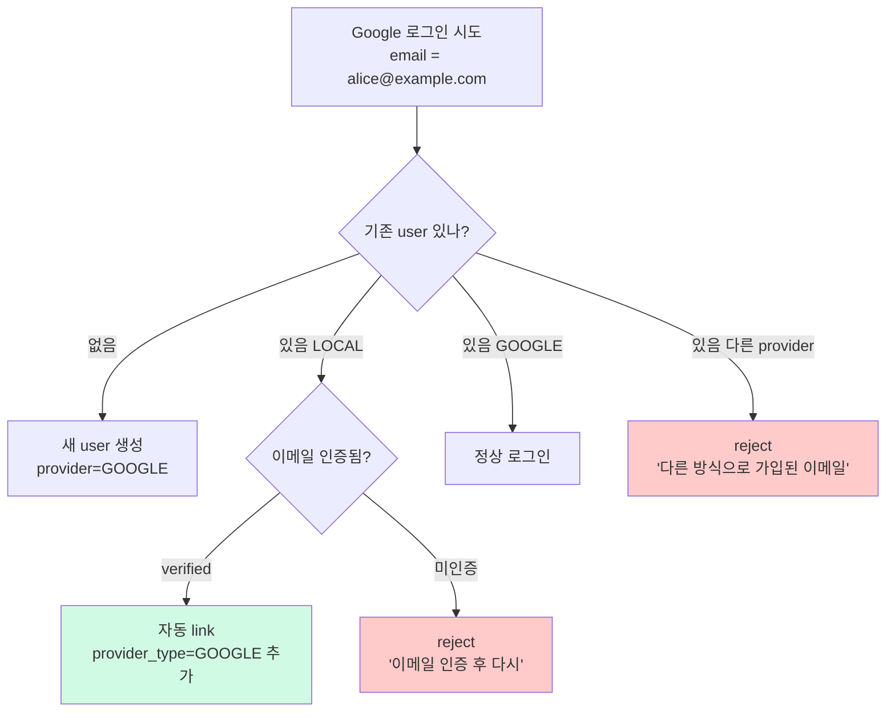

# 소셜 로그인 구현 — Apple / Google / Kakao / Naver

**[[implementation|↑ implementation hub]]**

> 4개 provider 의 OAuth2 / OIDC 흐름 통합. 정책 결정은 [[../design-decisions/social-login-providers]].

---

## 1. 흐름 개요 — OAuth2 Authorization Code



자세히: [[../design-decisions/social-login-providers]].

---

## 2. API spec

### 2.1 소셜 로그인 (가입 + 로그인 통합)

```http
POST /api/v1/auth/login/social
Content-Type: application/json
{
  "provider": "KAKAO",
  "code": "abc123...",
  "state": "01HQXY..."
}

200 OK
{
  "code": "OK_001",
  "data": {
    "accessToken": "eyJ...",
    "refreshToken": "9f4b...",
    "tokenType": "Bearer",
    "expiresIn": 900,
    "isNewUser": true
  }
}
```

### 2.2 Apple revocation webhook

```http
POST /webhook/apple
{
  "events": [
    { "type": "consent-revoked", "sub": "001234.abcd5678..." }
  ]
}

200 OK
```

→ Apple ID 의 앱 권한 취소 시 발송. user 의 refresh tokens 모두 revoke.

---

## 3. 도메인 — 추가 컬럼

`users` 테이블에 이미 정의됨 — [[../database/users-table#2.8]] · [[../database/users-table#2.9]]:

```sql
provider_type VARCHAR(20)   -- LOCAL / APPLE / GOOGLE / KAKAO / NAVER
external_id   VARCHAR(100)  -- 각 provider 의 sub
apple_sub     VARCHAR(100)  -- Apple 만 별도 (revocation webhook)
```

```sql
CREATE UNIQUE INDEX ux_users_provider_external
    ON users (provider_type, external_id)
    WHERE external_id IS NOT NULL;
```

### 3.1 왜 provider_type + external_id 둘 다 UNIQUE

**왜 필요**
- 한 Apple 계정이 여러 user 생성 차단 — 같은 (KAKAO, "12345") = 같은 사람.
- email 만 UNIQUE 시 — Apple 의 "Hide My Email" 로 매번 다른 email → 같은 사람 중복 가입 가능.

**왜 partial unique (`WHERE external_id IS NOT NULL`)**
- LOCAL user 는 external_id NULL.
- NULL × NULL 의 SQL UNIQUE 처리 표준이 약함 → partial 로 명확히.

자세히: [[../database/users-table#3.2]].

---

## 4. Domain — Social Provider 인터페이스

```java
public interface SocialProvider {
    SocialProviderType type();
    SocialUserInfo verifyAndFetchUserInfo(String code);
}

public record SocialUserInfo(
    String externalId,             // provider 의 sub
    String email,                  // null 가능 (Apple Hide My Email)
    boolean emailVerified,         // provider 가 인증한 email 인지
    String name                    // null 가능
) {}
```

### 4.1 왜 추상화

- 4 provider 의 응답 / 인증 흐름 다름.
- UseCase 는 provider 별 차이 X — `SocialProvider` 만 호출.
- 새 provider (Facebook, GitHub) 추가 시 새 구현체만.

---

## 5. UseCase — SocialLoginUseCase

```java
@Service
@RequiredArgsConstructor
@Slf4j
public class SocialLoginUseCase {

    private final UserRepository users;
    private final Map<SocialProviderType, SocialProvider> providers;
    private final JwtTokenProvider jwt;
    private final RefreshTokenService rtService;
    private final IdGenerator ids;
    private final Clock clock;
    private final AuthAuditLogger auditLogger;

    @Transactional
    public SocialLoginResult handle(SocialProviderType providerType, String code,
                                     String device, String ip) {
        // 1. provider 의 token / userinfo 검증
        var provider = providers.get(providerType);
        if (provider == null)
            throw new BusinessException(ResponseCode.INVALID_INPUT_FORMAT,
                "unsupported provider: " + providerType);

        var userInfo = provider.verifyAndFetchUserInfo(code);

        // 2. user 조회 / 가입
        boolean isNewUser = false;
        var user = users.findByProviderAndExternalId(providerType, userInfo.externalId())
            .orElseGet(() -> {
                var newUser = registerSocialUser(providerType, userInfo);
                return users.save(newUser);
            });
        isNewUser = (user.createdAt().equals(Instant.now(clock).truncatedTo(ChronoUnit.SECONDS)));

        // 3. status 검증
        if (!user.isActive())
            throw new BusinessException(ResponseCode.FORBIDDEN, "계정 비활성");

        // 4. JWT + RT
        var sessionId = UUID.randomUUID().toString();
        var access = jwt.generateAccessToken(user.email().value(), user.id().value(),
                                             user.role(), sessionId);
        var rt = rtService.issue(user.id(), device, ip);

        auditLogger.log(AuthAuditEvent.socialLoginSuccess(user.id(), providerType));
        return new SocialLoginResult(access, rt.raw(), rt.expiresAt(), isNewUser);
    }

    private User registerSocialUser(SocialProviderType type, SocialUserInfo info) {
        // Apple 의 email 부재 케이스 — placeholder
        var email = info.email() != null
            ? new Email(info.email().trim().toLowerCase(Locale.ROOT))
            : new Email(info.externalId() + "@" + type.name().toLowerCase() + "-private.local");

        // 같은 email 이 이미 LOCAL 가입돼 있다면?
        if (info.email() != null && info.emailVerified()) {
            users.findByEmail(email).ifPresent(existing -> {
                if (existing.providerType() != SocialProviderType.LOCAL)
                    throw new BusinessException(ResponseCode.DUPLICATE_DATA,
                        "이미 다른 provider 로 가입된 이메일");
                // verified LOCAL → 자동 link 정책 (design-decisions/social-login-providers#7)
            });
        }

        return User.registerSocial(
            new UserId(ids.next()), email, info.name() != null ? info.name() : "user",
            type, info.externalId(), Instant.now(clock)
        );
    }
}

public record SocialLoginResult(
    String accessToken, String refreshToken, Instant refreshExpiresAt, boolean isNewUser
) {}
```

### 5.1 왜 가입 / 로그인 통합 endpoint

- 사용자 입장: "Login with Kakao" 클릭 시 신규/기존 신경 안 씀.
- 분리 endpoint 시 — 클라가 provider 응답 받은 후 신규/기존 판단 후 다른 endpoint 호출 = 복잡.
- 통합 = 서버가 알아서 처리, 응답에 `isNewUser` 만 표시.

### 5.2 왜 `Map<SocialProviderType, SocialProvider>` 주입

- Spring 이 각 provider 구현체 (KakaoProvider, AppleProvider) 자동 주입 + Map 으로.
- UseCase 가 if/else X.

```java
@Configuration
public class SocialProviderConfig {
    @Bean
    public Map<SocialProviderType, SocialProvider> socialProviders(List<SocialProvider> providers) {
        return providers.stream()
            .collect(Collectors.toMap(SocialProvider::type, Function.identity()));
    }
}
```

### 5.3 왜 Apple email 부재 시 placeholder

- Apple 의 "Hide My Email" — `xxx@privaterelay.appleid.com` (random).
- 두 번째 로그인부터 email 없음 (sub 만).
- placeholder `{sub}@apple-private.local` 로 저장 → user 식별 가능 + email UNIQUE 통과.

---

## 6. Provider 구현 — Kakao

```java
@Component
@RequiredArgsConstructor
@Slf4j
public class KakaoSocialProvider implements SocialProvider {

    private final WebClient webClient;
    @Value("${social.kakao.client-id}") String clientId;
    @Value("${social.kakao.client-secret}") String clientSecret;
    @Value("${social.kakao.redirect-uri}") String redirectUri;

    @Override public SocialProviderType type() { return SocialProviderType.KAKAO; }

    @Override
    public SocialUserInfo verifyAndFetchUserInfo(String code) {
        // 1. token 발급
        var tokenResponse = webClient.post()
            .uri("https://kauth.kakao.com/oauth/token")
            .contentType(MediaType.APPLICATION_FORM_URLENCODED)
            .bodyValue(Map.of(
                "grant_type", "authorization_code",
                "client_id", clientId,
                "client_secret", clientSecret,
                "redirect_uri", redirectUri,
                "code", code
            ))
            .retrieve()
            .bodyToMono(KakaoTokenResponse.class)
            .block();

        // 2. userinfo
        var userInfo = webClient.get()
            .uri("https://kapi.kakao.com/v2/user/me")
            .header(HttpHeaders.AUTHORIZATION, "Bearer " + tokenResponse.accessToken())
            .retrieve()
            .bodyToMono(KakaoUserInfoResponse.class)
            .block();

        return new SocialUserInfo(
            String.valueOf(userInfo.id()),
            userInfo.kakaoAccount() != null ? userInfo.kakaoAccount().email() : null,
            userInfo.kakaoAccount() != null && userInfo.kakaoAccount().emailVerified(),
            userInfo.kakaoAccount() != null && userInfo.kakaoAccount().profile() != null
                ? userInfo.kakaoAccount().profile().nickname() : null
        );
    }

    record KakaoTokenResponse(
        @JsonProperty("access_token") String accessToken,
        @JsonProperty("refresh_token") String refreshToken,
        @JsonProperty("id_token") String idToken
    ) {}

    record KakaoUserInfoResponse(
        Long id,
        @JsonProperty("kakao_account") KakaoAccount kakaoAccount
    ) {
        record KakaoAccount(
            String email,
            @JsonProperty("email_verified") boolean emailVerified,
            Profile profile
        ) {
            record Profile(String nickname) {}
        }
    }
}
```

### 6.1 왜 token + userinfo 2회 호출

- token 응답에 user 정보 부분만 (sub, name 등).
- 전체 userinfo (email, nickname) 는 별도 endpoint.
- Kakao 의 API 구조 따른.

### 6.2 Naver / Google — 동일 패턴

- Naver: `https://nid.naver.com/oauth2.0/token` + `/v1/nid/me`.
- Google: `https://oauth2.googleapis.com/token` + `id_token` 자체에서 claim 추출 (OIDC).

---

## 7. Provider 구현 — Apple (가장 어려움)

```java
@Component
@RequiredArgsConstructor
@Slf4j
public class AppleSocialProvider implements SocialProvider {

    private final WebClient webClient;
    private final AppleJwksCache jwksCache;        // JWKS public key cache

    @Value("${social.apple.client-id}") String clientId;
    @Value("${social.apple.team-id}") String teamId;
    @Value("${social.apple.key-id}") String keyId;
    @Value("${social.apple.private-key}") String privateKey;   // base64

    @Override public SocialProviderType type() { return SocialProviderType.APPLE; }

    @Override
    public SocialUserInfo verifyAndFetchUserInfo(String code) {
        // 1. client_secret JWT 생성 (Apple 요구)
        var clientSecret = generateClientSecret();

        // 2. token 발급
        var tokenResponse = webClient.post()
            .uri("https://appleid.apple.com/auth/token")
            .contentType(MediaType.APPLICATION_FORM_URLENCODED)
            .bodyValue(Map.of(
                "grant_type", "authorization_code",
                "client_id", clientId,
                "client_secret", clientSecret,
                "code", code
            ))
            .retrieve()
            .bodyToMono(AppleTokenResponse.class)
            .block();

        // 3. id_token 검증 (RS256 + JWKS)
        var claims = verifyIdToken(tokenResponse.idToken());

        return new SocialUserInfo(
            claims.getSubject(),                                    // sub
            claims.get("email", String.class),                      // 첫 로그인만
            claims.get("email_verified", Boolean.class) != null
                && claims.get("email_verified", Boolean.class),
            null                                                     // name 은 별도 (첫 로그인 응답에서만)
        );
    }

    private String generateClientSecret() {
        // ES256 으로 signed JWT 생성 (Apple 요구)
        var key = ECPrivateKey.fromPkcs8(privateKey);
        var now = Instant.now();
        return Jwts.builder()
            .header().keyId(keyId).and()
            .issuer(teamId)
            .audience().add("https://appleid.apple.com").and()
            .subject(clientId)
            .issuedAt(Date.from(now))
            .expiration(Date.from(now.plus(Duration.ofMinutes(5))))
            .signWith(key, Jwts.SIG.ES256)
            .compact();
    }

    private Claims verifyIdToken(String idToken) {
        var unverifiedHeader = Jwts.parser().build().parseUnsecuredClaims(idToken).getHeader();
        var kid = (String) unverifiedHeader.get("kid");
        var publicKey = jwksCache.getPublicKey(kid);

        return Jwts.parser()
            .verifyWith(publicKey)
            .requireIssuer("https://appleid.apple.com")
            .requireAudience(clientId)
            .build()
            .parseSignedClaims(idToken)
            .getPayload();
    }
}
```

### 7.1 왜 client_secret 이 JWT (string 아님)

- Apple 의 보안 정책 — static secret X.
- 매 요청마다 team_id + key_id 로 ES256 signed JWT 생성.
- 5분 짧은 만료.

### 7.2 왜 id_token 직접 검증 (userinfo endpoint X)

- Apple 은 userinfo endpoint 없음.
- id_token 의 claim 안에 sub, email 등.
- JWKS public key 로 서명 검증 (Apple 의 rotation 대응).

자세히: [[../design-decisions/social-login-providers#5 Apple 특수 처리]].

### 7.3 JWKS Cache

```java
@Component
@RequiredArgsConstructor
public class AppleJwksCache {
    private final WebClient webClient;
    private final Cache<String, PublicKey> cache;     // Caffeine — 24h

    public PublicKey getPublicKey(String kid) {
        return cache.get(kid, this::fetchFromApple);
    }

    private PublicKey fetchFromApple(String kid) {
        var jwks = webClient.get()
            .uri("https://appleid.apple.com/auth/keys")
            .retrieve()
            .bodyToMono(JwksResponse.class)
            .block();
        return jwks.keys().stream()
            .filter(k -> k.kid().equals(kid))
            .findFirst()
            .map(JwkResponse::toPublicKey)
            .orElseThrow();
    }
}
```

**왜 cache 24h**
- Apple 의 public key rotation — 보통 ~6개월.
- 매 로그인마다 fetch → Apple endpoint 부담.
- 24h cache = key rotation 대응 + Apple 부담 ↓.

---

## 8. Apple Revocation Webhook

```java
@RestController
@RequestMapping("/webhook/apple")
@RequiredArgsConstructor
public class AppleWebhookController {

    private final UserRepository users;
    private final RefreshTokenRepository refreshTokens;

    @PostMapping
    public ResponseEntity<Void> handle(@RequestBody AppleWebhookPayload payload) {
        for (var event : payload.events()) {
            if ("consent-revoked".equals(event.type()) || "account-delete".equals(event.type())) {
                users.findByAppleSub(event.sub()).ifPresent(user -> {
                    user.markRevoked();
                    users.save(user);
                    refreshTokens.revokeAllForUser(user.id(), "APPLE_REVOKED");
                });
            }
        }
        return ResponseEntity.ok().build();
    }
}
```

### 8.1 왜 필요

- App Store 정책 — Apple Sign In 사용 시 revocation webhook 강제.
- 미준수 시 앱 reject.

### 8.2 왜 sub 로 찾기 (email 아님)

- email 변경 가능 / private email relay.
- sub = 영구 식별자.

자세히: [[../design-decisions/social-login-providers#5.4]].

---

## 9. Email 통합 정책 — 같은 email 의 LOCAL + 소셜



자세히: [[../design-decisions/social-login-providers#7]].

---

## 10. SecurityConfig

```java
.requestMatchers(HttpMethod.POST,
    "/api/v1/auth/login/social"
).permitAll()
.requestMatchers(HttpMethod.POST,
    "/webhook/apple"
).permitAll()           // signature 검증으로 보호
```

---

## 11. Controller

```java
@Tag(name = "소셜 로그인")
@RestController
@RequestMapping("/api/v1/auth/login")
@RequiredArgsConstructor
public class SocialLoginController {

    private final SocialLoginUseCase useCase;

    @Operation(summary = "소셜 로그인 (가입 + 로그인)")
    @PostMapping("/social")
    public ResponseEntity<CommonResponse<SocialLoginResponse>> social(
        @Valid @RequestBody SocialLoginRequest req,
        HttpServletRequest http
    ) {
        var device = http.getHeader("User-Agent");
        var ip = ClientIpUtil.resolveClientIp(http);
        var result = useCase.handle(req.provider(), req.code(), device, ip);

        return ResponseEntity.ok(CommonResponse.success(ResponseCode.OK,
            new SocialLoginResponse(
                result.accessToken(),
                result.refreshToken(),
                "Bearer",
                result.expiresInSeconds(),
                result.isNewUser()
            ),
            result.isNewUser() ? "가입 및 로그인 완료" : "로그인 완료"));
    }
}

public record SocialLoginRequest(
    @NotNull SocialProviderType provider,
    @NotBlank String code,
    @NotBlank String state
) {}

public record SocialLoginResponse(
    String accessToken, String refreshToken, String tokenType,
    long expiresIn, boolean isNewUser
) {}
```

---

## 12. 환경 변수

```bash
# Kakao
SOCIAL_KAKAO_CLIENT_ID=<KMS>
SOCIAL_KAKAO_CLIENT_SECRET=<KMS>
SOCIAL_KAKAO_REDIRECT_URI=https://app.example.com/auth/callback/kakao

# Naver
SOCIAL_NAVER_CLIENT_ID=<KMS>
SOCIAL_NAVER_CLIENT_SECRET=<KMS>
SOCIAL_NAVER_REDIRECT_URI=https://app.example.com/auth/callback/naver

# Google
SOCIAL_GOOGLE_CLIENT_ID=<KMS>
SOCIAL_GOOGLE_CLIENT_SECRET=<KMS>
SOCIAL_GOOGLE_REDIRECT_URI=https://app.example.com/auth/callback/google

# Apple
SOCIAL_APPLE_CLIENT_ID=com.example.shop
SOCIAL_APPLE_TEAM_ID=ABC123XYZ
SOCIAL_APPLE_KEY_ID=DEF456
SOCIAL_APPLE_PRIVATE_KEY=<KMS base64>
```

---

## 13. 함정 모음

### 함정 1 — state parameter 검증 X
CSRF 가능 — 공격자가 authorization_code 도용.
→ state = random + session 매핑 + 검증.

### 함정 2 — Apple JWT 서명 skip
위조 가능.
→ JWKS public key 검증 필수.

### 함정 3 — JWKS endpoint 매 호출
Apple 부담 + rate limit.
→ 24h cache.

### 함정 4 — Apple revocation webhook 안 받음
App Store reject.
→ POST /webhook/apple.

### 함정 5 — (provider, external_id) UNIQUE 누락
한 Apple 계정으로 여러 user 생성.
→ partial unique 필수.

### 함정 6 — Apple 첫 로그인의 email 안 저장
두 번째부터 email 없음 → user 식별 X.
→ 첫 응답 email DB 저장.

### 함정 7 — Apple private email 무시
`xxx@privaterelay.appleid.com` 로 마케팅 메일 → bounce.
→ bounce webhook 처리.

### 함정 8 — Email 자동 link (verified 검증 없이)
이메일 미인증 LOCAL user 와 자동 link → 계정 탈취.
→ email_verified=true 만 link.

### 함정 9 — provider 의 access_token 영구 저장
도난 시 provider API 무한 호출.
→ 검증 후 즉시 폐기.

### 함정 10 — redirect_uri 검증 skip
악의적 redirect → code 도난.
→ provider 의 등록된 URI 정확 일치.

### 함정 11 — Provider 응답 user_info 매 호출
provider rate limit.
→ 가입 시 한 번만 + DB 캐시.

### 함정 12 — Map<Provider, Impl> 주입 누락
새 provider 추가 시 if/else 코드.
→ Spring 자동 주입 패턴.

### 함정 13 — Apple client_secret static 사용
Apple 정책 위반.
→ ES256 signed JWT 매번.

### 함정 14 — 같은 email 다른 provider 자동 통합
사용자 의도 X.
→ verified email 만 자동 link.

---

## 14. 관련

- [[implementation|↑ implementation hub]]
- [[../design-decisions/social-login-providers]] — 정책 / 도구 결정
- [[../database/users-table#2.8]] — provider_type / external_id schema
- [[../design-decisions/token-model]] — JWT 발급
- [[login-impl]] · [[token-refresh-impl]] — 토큰 관리
- 외부 — Kakao OAuth, Apple Sign In Docs, OIDC spec
