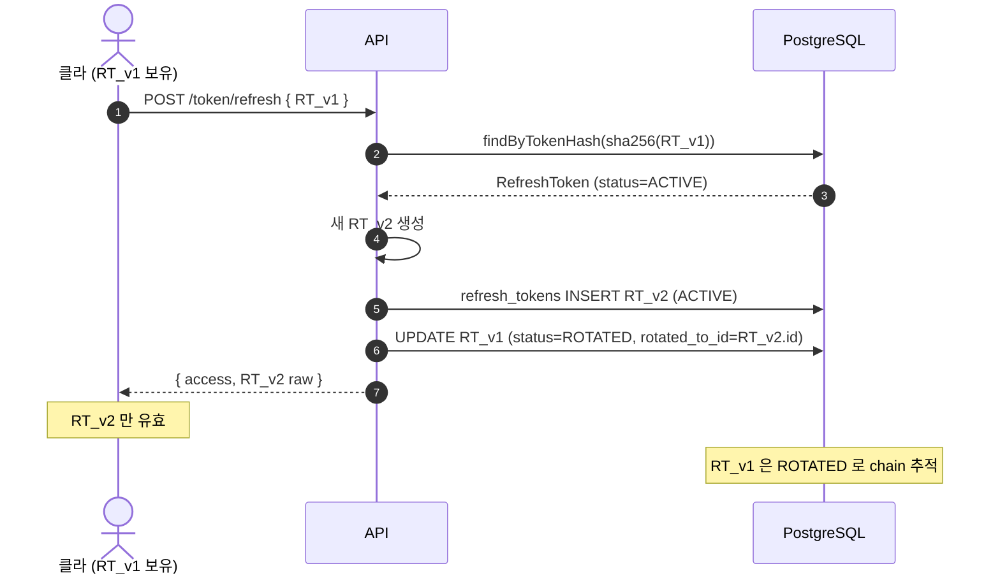
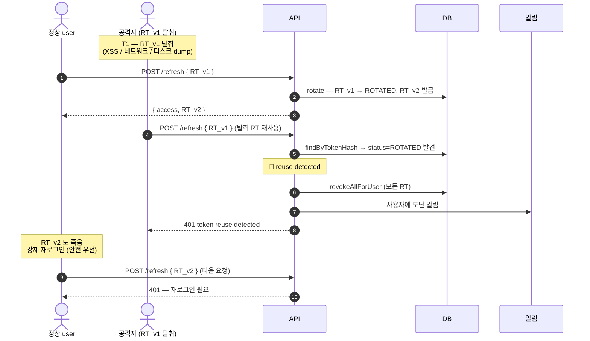
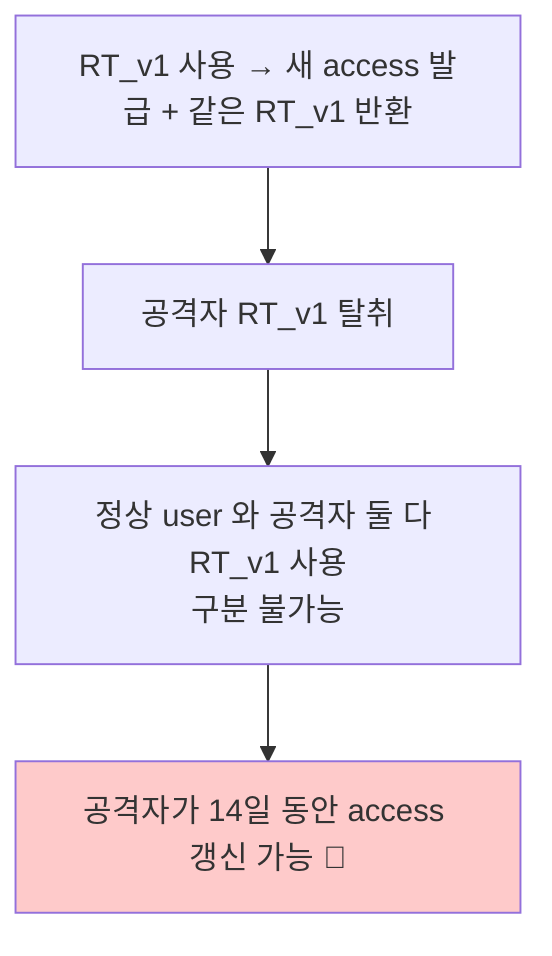
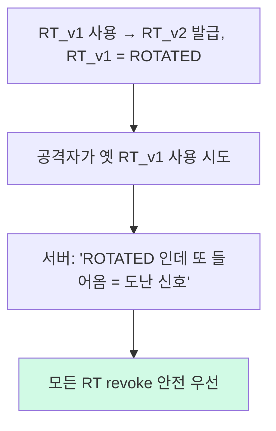
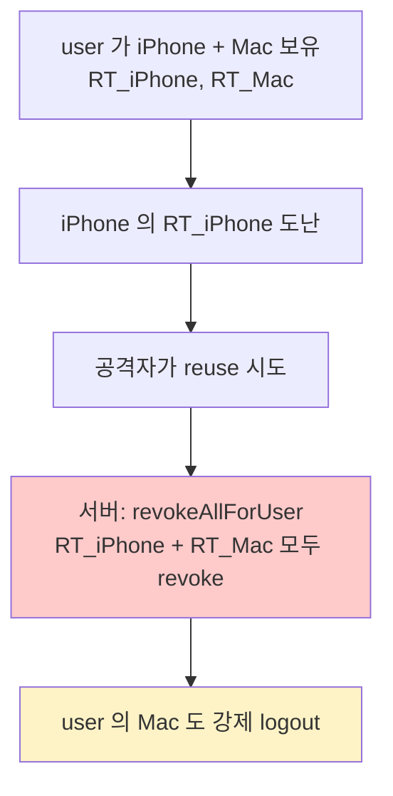

# 토큰 갱신 (refresh rotation + reuse detection)

**[[implementation|↑ implementation hub]]**

> 토큰 도난 대응의 핵심. rotation = 정상 흐름, reuse detection = 도난 감지.
> 잘못 구현하면 **도난 후 영구 사용 / 정상 retry 가 reuse 로 오인**.

---

## 1. 흐름 개요

### 1.1 정상 흐름 (rotation)



### 1.2 도난 흐름 (reuse detection)



---

## 2. API spec

```http
POST /api/v1/auth/refresh
Content-Type: application/json
{ "refreshToken": "9f4b3a2c-...-base64url" }
```

```http
200 OK
{
  "code": "OK_001",
  "data": {
    "accessToken": "eyJ...",
    "refreshToken": "newrandom...-base64url",      ← 매번 새로 (rotation)
    "tokenType": "Bearer",
    "expiresIn": 900
  }
}
```

**실패 응답**

| Status | Code | 사유 |
| --- | --- | --- |
| 401 | INVALID_TOKEN | 토큰 없음 / 형식 오류 / EXPIRED / REVOKED |
| 401 | TOKEN_REUSE_DETECTED | ROTATED 토큰 재사용 — chain 전체 revoke |

---

## 3. Rotation 정책 — 왜 매번 새 RT

### 3.1 안 하면 무슨 문제



### 3.2 Rotation 후



→ **도난 감지 가능** + **공격자 사용 시 즉시 무력화**.

### 3.3 트레이드오프

- 네트워크 retry 가 reuse 로 오인 가능 (§6.2 참고).
- DB write 빈도 ↑ (매 refresh 마다 INSERT + UPDATE).
- 안전 vs 운영 부담의 균형 — 본 vault 는 안전 우선.

자세히: [[../design-decisions/token-model#5.1]].

---

## 4. Reuse Detection — 깊은 분석

### 4.1 시나리오 시각화

```
T0:  user.login → RT_A 발급 (ACTIVE)
T1:  공격자가 RT_A 탈취 (XSS / 네트워크 / 메모리 dump)
T2:  user.refresh(RT_A) → RT_B 발급, RT_A → ROTATED
T3:  공격자.refresh(RT_A) → 서버: ROTATED + reuse 감지 → 모든 RT 죽임
T4:  user.refresh(RT_B) → 죽음, 강제 재로그인
```

### 4.2 왜 모든 RT 죽이는가 (해당 RT 만 X)

- **누가 진짜인지 식별 불가**.
- 정상 user 인지 공격자인지 — 둘 다 같은 device fingerprint / IP 일 수 있음.
- 안전 우선 = 둘 다 강제 재로그인.
- 진짜 user 는 재로그인하면 됨.
- 공격자는 password 모르면 못 들어옴.

### 4.3 chain 전체 revoke (단순 revoke X)

```sql
WITH RECURSIVE chain AS (
    SELECT id FROM refresh_tokens WHERE id = ?    -- 도난 RT
    UNION ALL
    SELECT rt.id FROM refresh_tokens rt
    JOIN chain c ON rt.id = c.rotated_to_id
)
UPDATE refresh_tokens SET status = 'REVOKED',
    revoked_at = now(), revoked_reason = 'REUSE_DETECTED'
WHERE id IN (SELECT id FROM chain)
   OR (user_id = ? AND status = 'ACTIVE');
```

→ 도난 chain + 현재 ACTIVE 모두.

자세히: [[../database/refresh-tokens-table#3 Rotation Chain]].

---

## 5. RefreshTokenService — rotate 구현

자세히는 [[login-impl#8]]. 핵심만 재게.

```java
@Transactional
public IssuedRefreshToken rotate(String rawIncoming, String device, String ip) {
    var hash = sha256Hex(rawIncoming);
    var current = tokens.findByTokenHash(hash)
        .orElseThrow(() -> new BusinessException(ResponseCode.INVALID_TOKEN));

    var now = Instant.now(clock);

    switch (current.status()) {
        case ROTATED -> {
            // 🚨 도난 의심 — 모든 RT revoke
            int revoked = tokens.revokeAllForUser(current.userId(), "REUSE_DETECTED");
            auditLogger.log(AuthAuditEvent.suspiciousReuse(current.userId(), current.id()));
            suspiciousActivityNotifier.notify(current.userId(),
                "다른 위치에서 로그인 시도가 감지되었습니다");
            throw new BusinessException(ResponseCode.UNAUTHORIZED,
                "token reuse detected; please sign in again");
        }
        case REVOKED -> throw new BusinessException(ResponseCode.INVALID_TOKEN, "revoked");
        case EXPIRED -> throw new BusinessException(ResponseCode.INVALID_TOKEN, "expired");
        case ACTIVE -> {}
    }
    if (!current.isUsable(now))
        throw new BusinessException(ResponseCode.INVALID_TOKEN, "not usable");

    var newOne = issue(current.userId(), device, ip);
    current.rotate(newOne.id(), now);
    tokens.save(current);
    return newOne;
}
```

### 5.1 왜 `@Transactional`

- rotate = "옛 RT 의 status 변경 + 새 RT INSERT" — atomic 필요.
- 한쪽 실패 시 둘 다 rollback.

### 5.2 왜 status switch (단순 check 아님)

- 각 상태별 다른 응답 / 처리:
  - ROTATED = 도난 → 모든 revoke + 알림.
  - REVOKED / EXPIRED = 명시 logout / TTL → 단순 401.
  - ACTIVE = 정상 흐름.

### 5.3 왜 suspiciousActivityNotifier

- 사용자가 모르고 강제 logout → CS 문의 폭주.
- 도난 알림 = 사용자 보안 awareness.
- 비즈니스 / 평판 보호.

---

## 6. Controller

```java
@Tag(name = "토큰")
@RestController
@RequestMapping("/api/v1/auth")
@RequiredArgsConstructor
public class TokenController {

    private final RefreshTokenService rtService;
    private final JwtTokenProvider jwt;
    private final UserRepository users;

    @Operation(summary = "토큰 갱신 (refresh rotation)")
    @PostMapping("/refresh")
    public ResponseEntity<CommonResponse<TokenResponse>> refresh(
        @Valid @RequestBody RefreshRequest req,
        HttpServletRequest http
    ) {
        var device = http.getHeader("User-Agent");
        var ip = ClientIpUtil.resolveClientIp(http);

        var newRt = rtService.rotate(req.refreshToken(), device, ip);
        var user = users.findById(newRt.userId())
            .orElseThrow(() -> new BusinessException(ResponseCode.USER_NOT_FOUND));

        var sessionId = UUID.randomUUID().toString();
        var access = jwt.generateAccessToken(user.email().value(), user.id().value(),
                                             user.role(), sessionId);

        return ResponseEntity.ok(CommonResponse.success(ResponseCode.OK,
            new TokenResponse(access, newRt.raw(), "Bearer", 900L),
            "토큰 갱신 완료"));
    }
}

public record RefreshRequest(@NotBlank String refreshToken) {
    @Override public String toString() {
        return "RefreshRequest[refreshToken=***]";
    }
}
```

---

## 7. Edge Cases — 운영 시 흔한 시나리오

### 7.1 동시 reuse — race condition

```
T0: 공격자 .refresh(RT_A)  [Tx 1]
T0: user.refresh(RT_A)     [Tx 2]
   둘 다 status=ACTIVE 보고 rotate 시도
   한쪽이 먼저 commit → 다른 쪽은 status=ROTATED 발견 → reuse detected
```

**문제**
- 누가 attacker 인지 식별 불가 — 같은 IP/device 일 수도.

**해결**
- 모든 RT revoke (안전 우선).
- 둘 다 강제 재로그인.

### 7.2 정상 retry 가 reuse 로 오인

```
T0: 클라.refresh(RT_A)
T1: 서버: rotate 성공 (RT_B 발급, RT_A → ROTATED)
T2: 네트워크 실패 — 클라 응답 못 받음
T3: 클라.retry .refresh(RT_A)  ← 서버 입장에선 reuse
T4: 서버: ROTATED 감지 → 모든 RT revoke (오인)
```

**해결 옵션 A**: Idempotency-Key (권장)
- 클라가 UUID 생성.
- 서버가 같은 key → 같은 응답 (RT_B) 반환.
- retry 안전.

**해결 옵션 B**: Grace period
- ROTATED 후 짧은 시간 (10초) 안의 같은 RT 재사용 = 같은 응답.
- 시간 후엔 reuse 감지.
- 단 복잡.

본 vault: **옵션 A** (Idempotency-Key).

자세히: [[../design-decisions/idempotency-policy]].

### 7.3 다중 디바이스 — 한 device 의 도난



**trade-off**
- 안전 우선 (모든 device) vs UX (해당 device 만).
- 본 vault: 모든 device.
- 사용자 알림 시 "다른 디바이스에서도 다시 로그인이 필요합니다" 설명.

---

## 8. 만료된 RT cleanup — Scheduler

```java
@Component
@RequiredArgsConstructor
@Slf4j
public class RefreshTokenCleanupJob {

    private final RefreshTokenJpaRepository tokens;

    @Scheduled(cron = "0 0 4 * * *")              // 매일 새벽 4시
    @SchedulerLock(name = "refreshTokenCleanup", lockAtMostFor = "PT1H")
    public void cleanup() {
        var cutoff = Instant.now().minus(Duration.ofDays(7));
        int deleted = tokens.deleteByExpiresAtBefore(cutoff);
        log.info("refresh token cleanup: {} rows deleted", deleted);
    }
}
```

### 8.1 왜 7일 grace period

- 사용자 CS 응대 자료.
- 도난 분석 (chain 추적).
- 너무 짧으면 분석 X, 너무 길면 인덱스 비대.

### 8.2 왜 ShedLock

- 다중 인스턴스 환경 — 같은 cron 시점에 동시 실행.
- ShedLock 이 single instance 보장.
- DB / Redis backend.

자세히: [[../database/refresh-tokens-table#6 Cleanup]] · [[../../distributed-lock]].

---

## 9. 함정 모음

### 함정 1 — Rotation 없음
탈취 시 14일 영구 사용.
→ 매번 새 RT + 옛 RT = ROTATED.

### 함정 2 — Reuse detection 없음 (ROTATED 그대로 통과)
도난 감지 X.
→ ROTATED 시 모든 RT revoke + 알림.

### 함정 3 — 도난 chain 만 revoke (현재 ACTIVE 는 그대로)
공격자가 다른 device 의 RT 로 계속 사용.
→ 모든 ACTIVE revoke.

### 함정 4 — 알림 안 함
사용자 모름 → 재로그인 시 혼란.
→ 이메일 / 푸시 알림.

### 함정 5 — Idempotency 없음 (네트워크 retry 가 reuse 오인)
정상 retry → 모든 RT revoke.
→ Idempotency-Key 또는 grace period.

### 함정 6 — Refresh 와 access 가 같은 secret 으로 type 검증 X
access 토큰으로 refresh endpoint 호출 통과.
→ type claim 명시 (`"type": "ACCESS"` vs `"REFRESH"`) 또는 opaque refresh.

### 함정 7 — Cleanup 없음
DB 무한 증가.
→ daily cleanup + ShedLock.

### 함정 8 — Race condition (동시 rotate)
두 트랜잭션 같은 RT 사용 → 둘 다 성공?
→ DB UNIQUE 또는 `SELECT FOR UPDATE`.

### 함정 9 — `rotated_to_id` 누락
chain 추적 X → reuse 시 영향 범위 분석 어려움.
→ rotated_to_id 컬럼 + chain 추적 query.

### 함정 10 — 만료 검증을 application 만 (DB column 없음)
cleanup 시 전체 row decode → 비용 ↑.
→ DB `expires_at` column + 인덱스.

### 함정 11 — Clock skew 무시
서버 간 1초 차이로 만료 검증 어긋남.
→ NTP + clockSkewSeconds.

### 함정 12 — RT 가 매우 짧음 (5분)
재로그인 폭주.
→ 14일 + rotation 으로 사실상 슬라이딩.

---

## 10. 운영 체크리스트

- [ ] RT `token_hash` UNIQUE 인덱스
- [ ] Rotation 통합 테스트
- [ ] Reuse detection 시뮬레이션 IT
- [ ] Cleanup daily job + ShedLock
- [ ] Suspicious activity 알림 (이메일 / 푸시)
- [ ] Idempotency-Key 지원
- [ ] 만료된 RT 사용 시 401 + 명확 메시지
- [ ] Reuse 메트릭 + 알람

---

## 11. 관련

- [[implementation|↑ implementation hub]]
- [[login-impl]] — RefreshTokenService 정의
- [[../design-decisions/token-model]] — JWT vs Session
- [[../design-decisions/refresh-storage]] — RDB vs Redis
- [[../database/refresh-tokens-table]] — schema + rotation chain
- [[../security/attack-defense]] — 도난 대응
- [[../security/audit-logging]] — 보안 이벤트
