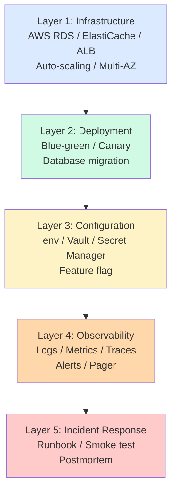

# auth §11 — 운영 (Hub)

**[[../signup|↑ signup hub]]**  ·  ← [[../testing/testing]]  ·  → [[../implementation-order]]

> 배포 / 모니터링 / 운영 / 장애 대응. **운영 부실 = 사용자 신뢰 손상 + 사고 시 복구 어려움**.

---

## 1. 이 폴더의 노트

| 노트 | 무엇 |
| --- | --- |
| [[configuration-secrets]] | 환경변수 / Vault / Secret Manager / config 정책 |
| [[observability]] | logging / metrics / tracing / alerts |
| [[deployment]] | Blue-green / Canary / DB 마이그레이션 + code 순서 |
| [[runbook]] | 장애 대응 / smoke test / 배포 직전 / 직후 체크리스트 |

---

## 2. SLA / SLO

| 메트릭 | 목표 (p99) | SLI |
| --- | --- | --- |
| Login 응답 시간 | < 500ms | http_server_requests_seconds |
| Signup 응답 시간 | < 1s | http_server_requests_seconds |
| Token refresh | < 100ms | http_server_requests_seconds |
| 가용성 | 99.9% / 월 | up |
| Email 발송 | 99.5% 5분 내 | email_outbox_sent_rate |
| SMS 발송 | 99% 30초 내 | sms_sent_rate |

### 2.1 SLA 깨질 때 vs Error Budget

- 99.9% = 월 43분 다운타임 OK.
- 초과 시 release freeze + 안정화.

---

## 3. 운영 layer



---

## 4. 시작 체크리스트

### 4.1 Infrastructure

- [ ] RDS PostgreSQL 16 (Multi-AZ, encryption at rest)
- [ ] ElastiCache Redis 7 (옵션)
- [ ] ALB + ACM 인증서
- [ ] CloudFront (CDN)
- [ ] WAF (AWS WAF / Cloudflare)

### 4.2 Deployment

- [ ] Blue-green / Canary 설정
- [ ] Flyway 마이그레이션 자동 (dev/staging) + 수동 (prod)
- [ ] Code 와 schema 의 호환성 정책 (expand/contract)

### 4.3 Configuration

- [ ] KMS / AWS Secrets Manager 사용
- [ ] 환경별 yml (`application-{profile}.yml`)
- [ ] Feature flag (LaunchDarkly / Unleash) — 점진 배포

### 4.4 Observability

- [ ] CloudWatch / Datadog / Grafana
- [ ] Prometheus / Micrometer 메트릭
- [ ] 알람 PagerDuty / Slack
- [ ] Sentry (application error)
- [ ] 로그 retention (CloudWatch 30일 + S3 1년)

### 4.5 Incident Response

- [ ] Runbook 작성 (장애 시나리오 별)
- [ ] On-call rotation
- [ ] Postmortem template
- [ ] 모든 사용자 강제 logout 절차 (보안 사고 시)

---

## 5. 보안 사고 대응 — auth 도메인 특화

### 5.1 모든 사용자 강제 logout

```sql
-- 모든 RT revoke
UPDATE refresh_tokens
SET status = 'REVOKED', revoked_at = now(), revoked_reason = 'SECURITY_INCIDENT'
WHERE status = 'ACTIVE';
```

→ access token 은 15분 후 자연 만료.

### 5.2 의심 user 강제 비밀번호 재설정

```sql
-- 영향받은 user 의 password 무효
UPDATE users SET password_hash = NULL, status = 'FORCE_RESET'
WHERE id IN (...);

-- 알림 메일 발송
```

### 5.3 침해 신고 — 한국 PIPC

- 72시간 내 신고 의무 (개인정보보호법).
- runbook 에 절차 명시.

자세히: [[runbook]].

---

## 6. 관련

- [[../signup|↑ signup hub]]
- [[../testing/testing]] — 이전 (§10)
- [[../implementation-order]] — 다음 (§12)
- [[../security/security]] — 보안 정책
- [[../pitfalls]] — 함정
