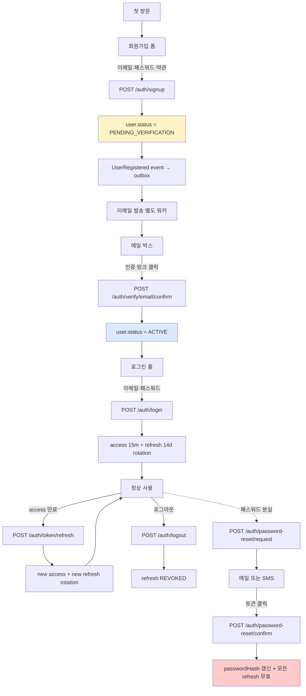
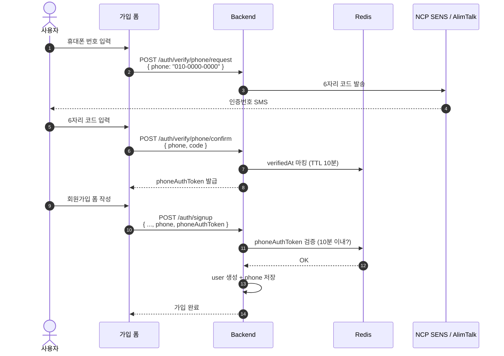
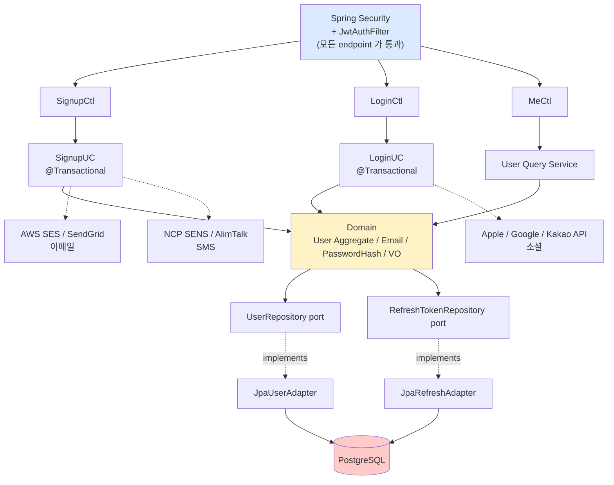

# auth §1 — 전체 흐름 overview

**[[signup|↑ hub]]**  ·  → [[prerequisites]]

> 회원가입부터 패스워드 리셋까지의 **end-to-end auth 흐름** 을 한 페이지에 그림.

---

## 1. 사용자 여정 (User Journey)

---

## 2. 휴대폰 인증이 포함된 흐름 (한국 표준)

한국 SaaS 는 보통 **휴대폰 인증을 가입 전제** 로 함 (SMS / AlimTalk).

상세: [[phone-verification-impl]].

---

## 3. 도메인 / 인프라 의존성 그림

> 💡 **점선** = 외부 / implements 관계. **실선** = 직접 호출.

---

## 4. 어떤 endpoint 가 비인증인가

| Endpoint | 인증 | 비고 |
| --- | --- | --- |
| `POST /auth/signup` | ❌ | 회원가입 자체 |
| `POST /auth/signup/social` | ❌ | provider 토큰만 검증 |
| `POST /auth/verify/email/request` | ✅ 인증 | 로그인 후 본인 메일 |
| `POST /auth/verify/email/confirm` | ❌ | 메일의 토큰 검증 |
| `POST /auth/verify/phone/request` | ❌ | 가입 전 + 가입 후 (재인증) |
| `POST /auth/verify/phone/confirm` | ❌ | 위와 같이 |
| `POST /auth/login` | ❌ | 로그인 |
| `POST /auth/login/social` | ❌ | 소셜 로그인 |
| `POST /auth/token/refresh` | ❌ | refresh token 만 검증 (Body) |
| `POST /auth/logout` | ❌ | refresh token 만 |
| `POST /auth/password-reset/request` | ❌ | 비인증 (잊었으니까) |
| `POST /auth/password-reset/confirm` | ❌ | 토큰 검증만 |
| `GET /me` | ✅ | access token 필수 |

→ SecurityConfig 의 `permitAll` 매트릭스. [[security#3 endpoint 인가 매트릭스]] 참조.

---

## 5. 각 흐름의 핵심 결정점

| 단계 | 핵심 결정 | 영향 |
| --- | --- | --- |
| 가입 — 인증 정책 | 이메일 / 휴대폰 / 둘 다 | 가입 friction vs 보안 |
| 가입 — 자동 로그인 | Yes / No | 본 vault: No (인증 후 별도 로그인) |
| 로그인 — 토큰 모델 | JWT only / Session / 둘 다 | 본 vault: access JWT + refresh opaque |
| 로그인 — refresh 저장 | RDB / Redis | 본 vault: RDB (영속) + 점진 Redis |
| 토큰 갱신 — rotation | Yes / No | 본 vault: Yes (탈취 감지) |
| 패스워드 리셋 — 채널 | 이메일 / SMS | 보통 이메일 (가입 인증 동일) |
| 다중 디바이스 — 동시 로그인 | 허용 / 단일 | 본 vault: 허용 (RefreshToken row N개) |

각 결정의 trade-off + 권장은 [[design-decisions]].

---

## 6. 이 폴더 코드의 재사용성

이 폴더의 코드는 **2 부분으로 구성**:

### A. 도메인 / 표준 부분 (그대로 복사)

- Value Objects (Email, PasswordHash, PhoneNumber, UserId, ...)
- User Aggregate + 상태 머신
- Domain Events
- Repository port + JPA Adapter
- Standard responses ([[../../common/response-envelope]])
- SecurityConfig + JwtTokenProvider ([[../../common/security-config]])

→ **거의 모든 SaaS 에서 그대로 사용 가능**.

### B. 정책 / 비즈니스 부분 (조정 필요)

- 약관 종류 (`terms` 테이블 시드)
- 이메일 템플릿 (`email-verification`, `password-reset`)
- SMS 템플릿
- 패스워드 정책 (길이 / 유출 차단 사용 여부)
- enumeration 정책 (409 vs 200)
- 가입 후 ACTIVE 여부 (이메일 인증 강제 / 선택)
- Rate limit 수치
- providerType (소셜 사용 여부)

→ **각 회사 / 도메인 정책에 따라 조정**.

---

## 7. 관련

- [[signup|↑ hub]]
- [[prerequisites]] — 다음 (§2)
- [[design-decisions]] — 권장 도구 가이드
