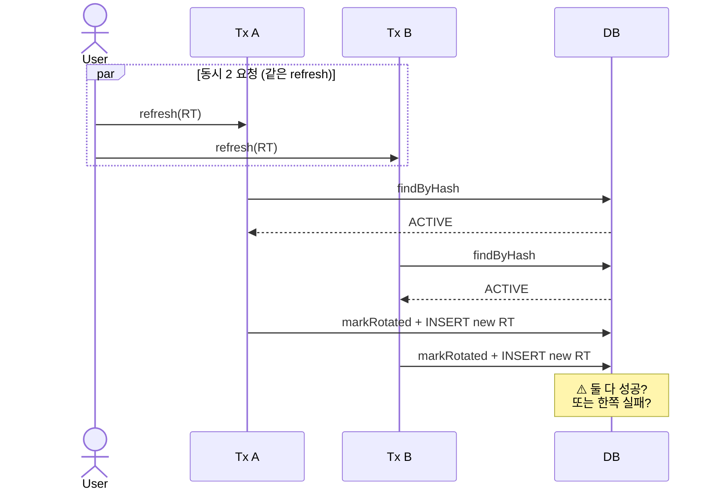

# 트랜잭션 / 동시성 함정

**[[pitfalls|↑ pitfalls hub]]**

> @Transactional 의 흔한 오해 + 외부 호출 / event listener 의 함정.

---

## 함정 1 — `@Transactional` 안에서 외부 API 호출

### 무엇

```java
@Transactional
public void signup(...) {
    users.save(user);
    sesClient.send(email, "...");        // ❌ 외부 호출
}
```

**문제**
- SES 응답 5초 → 트랜잭션 5초 락.
- SES 실패 → 트랜잭션 rollback → 회원가입 자체 실패.
- DB connection pool 고갈.

### 왜 위험

- 정상 작동 시에도 throughput ↓.
- 외부 장애 시 cascade — 모든 가입 멈춤.

### 해결

```java
@Transactional
public void signup(...) {
    users.save(user);
    eventPublisher.publishEvent(new UserRegistered(user.id()));
}

@TransactionalEventListener(phase = AFTER_COMMIT)
public void onRegistered(UserRegistered e) {
    outbox.enqueue(...);                    // 별도 트랜잭션
}
```

자세히: [[../database/email-outbox-table#3.2]].

---

## 함정 2 — Listener phase 가 `BEFORE_COMMIT` + 외부 호출

### 무엇

```java
@TransactionalEventListener(phase = BEFORE_COMMIT)
public void onRegistered(UserRegistered e) {
    sesClient.send(...);    // ❌
}
```

**문제**
- 트랜잭션 commit 전에 메일 발송.
- 트랜잭션 rollback 시 — 메일은 발송됐는데 사용자는 가입 안 된 상태.
- 사용자 항의 ("메일 받았는데 로그인 안 됨").

### 해결

- 외부 부수효과는 **AFTER_COMMIT** 만.
- BEFORE_COMMIT 은 같은 트랜잭션의 부수 DML (audit log 등) 용.

---

## 함정 3 — `@Transactional` self-invocation

### 무엇

```java
@Service
class SignupService {
    public void a() {
        b();    // ⚠️ same class
    }

    @Transactional
    public void b() {
        ...
    }
}
```

**문제**
- AOP proxy 가 `b()` 호출을 가로채야 트랜잭션 적용.
- `this.b()` 는 proxy 우회 → 트랜잭션 적용 X.

### 왜 위험

- silent — 컴파일 / 런타임 에러 X.
- 트랜잭션 의도 없는 곳에서 분리.

### 해결

**옵션 A: 별도 빈 분리**
```java
class A { @Autowired B b; void a() { b.b(); } }
class B { @Transactional void b() { ... } }
```

**옵션 B: self-injection**
```java
class SignupService {
    @Autowired SignupService self;
    public void a() { self.b(); }
}
```

**옵션 C: AspectJ 모드** (weaving) — 복잡.

---

## 함정 4 — 트랜잭션 격리 수준 오해

### 무엇

```java
@Transactional(isolation = Isolation.SERIALIZABLE)    // 과한 격리
```

### 왜 위험

- SERIALIZABLE = 모든 read 도 lock.
- 충돌 시 retry 필요.
- 성능 폭망.

### 해결

- 기본 (`READ_COMMITTED` for PostgreSQL) 충분.
- 명시 변경은 **꼭 필요한 경우만**.

---

## 함정 5 — `@Transactional(readOnly = true)` 안 사용

### 무엇

```java
@Transactional
public User findById(UserId id) {        // read-only 인데 readOnly=false
    return users.findById(id).orElseThrow();
}
```

**문제**
- write 트랜잭션 — DB 가 write lock 준비.
- 일부 ORM (Hibernate) 의 dirty check 활성.

### 해결

```java
@Transactional(readOnly = true)
public User findById(UserId id) { ... }
```

---

## 함정 6 — 비관 락 (`SELECT FOR UPDATE`) 남용

### 무엇

```java
@Lock(LockModeType.PESSIMISTIC_WRITE)
@Query("SELECT u FROM UserJpaEntity u WHERE u.id = :id")
User findByIdForUpdate(@Param("id") String id);
```

### 왜 위험

- row lock 점유 시간 ↑ → throughput ↓.
- deadlock 위험 (여러 row 다른 순서로 lock).

### 해결

- 낙관 락 (`@Version`) 우선.
- 비관 락은 **꼭 필요한 경우** (예: 결제 / 재고).

---

## 함정 7 — `@Async` 가 트랜잭션 전파 X

### 무엇

```java
@Transactional
public void signup(...) {
    users.save(user);
    asyncService.sendEmail(user.email());    // ❌ 별도 thread → 별도 transaction
}

@Async
public void sendEmail(...) {
    // 이 메서드는 main 트랜잭션 안에 있는 게 아님
}
```

**문제**
- @Async 가 별도 thread → 새 트랜잭션 컨텍스트.
- main rollback 해도 async 는 commit.

### 해결

- async 가 자체 트랜잭션 필요시 명시.
- 또는 `@TransactionalEventListener` 사용.

---

## 함정 8 — `existsByEmail` + INSERT race

### 무엇

```java
public void signup(...) {
    if (users.existsByEmail(email))        // 검증
        throw ...;
    users.save(user);                       // INSERT
}
```

**문제**
- 두 트랜잭션 동시 — 둘 다 false 받고 INSERT 시도.

### 해결

- DB UNIQUE constraint + DataIntegrityViolationException catch.
- 자세히: [[database-pitfalls#함정 2]].

---

## 함정 9 — Outbox 의 race (다중 워커)

### 무엇

```sql
SELECT * FROM email_outbox WHERE status = 'PENDING' LIMIT 50;
```

**문제**
- 두 워커 동시 — 같은 50 row 둘 다 처리 → 중복 발송.

### 해결

```sql
SELECT * FROM email_outbox
WHERE status = 'PENDING'
FOR UPDATE SKIP LOCKED
LIMIT 50;
```

- `SKIP LOCKED` — 다른 워커가 lock 잡은 row skip.

자세히: [[../database/email-outbox-table#8 함정 8]].

---

## 함정 10 — `Propagation.REQUIRES_NEW` 과다 사용

### 무엇

```java
@Transactional(propagation = REQUIRES_NEW)
public void log(...) { ... }
```

**문제**
- 새 트랜잭션 시작 + connection 추가.
- 중첩 호출 시 connection pool 빠르게 소모.

### 해결

- audit log 같은 명확한 경우만 `REQUIRES_NEW`.
- 단순 호출은 default (`REQUIRED`).

---

## 함정 11 — Connection leak

### 무엇

```java
@Autowired DataSource dataSource;

public void doSomething() {
    var conn = dataSource.getConnection();    // ❌ 직접
    // ... close 누락
}
```

### 왜 위험

- pool 고갈 → 모든 요청 fail.

### 해결

- JPA / JdbcTemplate 사용 — 자동 close.
- 직접 사용 시 try-with-resources.

---

## 함정 12 — `@Transactional` rollback rule 오해

### 무엇

```java
@Transactional
public void signup(...) throws BusinessException {
    ...
    throw new BusinessException(...);    // checked exception
}
```

**문제**
- default rollback rule = RuntimeException + Error.
- Checked exception 은 rollback X.

### 해결

```java
@Transactional(rollbackFor = BusinessException.class)
public void signup(...) throws BusinessException { ... }
```

또는 RuntimeException 으로.

---

## 함정 13 — N+1 query (트랜잭션 안)

### 무엇

```java
@Transactional
public List<UserInfo> listAll() {
    var users = userRepo.findAll();
    return users.stream().map(u -> {
        var orders = orderRepo.findByUserId(u.id());    // N+1
        return new UserInfo(u, orders);
    }).toList();
}
```

### 왜 위험

- 트랜잭션 시간 ↑ → connection lock.
- 사용자 수 ↑ 시 cascade.

### 해결

- JPA `@EntityGraph` / fetch join.
- DTO projection.

자세히: [[../../pitfalls/n-plus-one]].

---

## 함정 14 — JPA Lazy Loading 의 시점

### 무엇

```java
@Transactional
public User findById(...) {
    return users.findById(id).orElseThrow();
}

// Controller
public Response handle() {
    var user = service.findById(...);
    return new Response(user.orders());    // ❌ lazy collection
    // LazyInitializationException — 트랜잭션 끝남
}
```

### 해결

- `@Transactional` 을 더 위에 (Controller 의 service 호출 전체).
- DTO projection (service 안에서 모두 load).
- `open-in-view: false` 강제 (반드시 명시).

```yaml
spring:
  jpa:
    open-in-view: false        # 운영 권장
```

---

## 함정 15 — 동시 RT refresh — race

### 무엇



### 해결

- DB UNIQUE 또는 `SELECT FOR UPDATE`.
- 한쪽 실패 시 ROTATED 감지 (reuse detection).

---

## 관련

- [[pitfalls|↑ pitfalls hub]]
- [[../transactions]] — 트랜잭션 정책 전반
- [[../database/email-outbox-table]] — outbox 패턴
- [[../../pitfalls]] — 일반 트랜잭션 / 동시성 함정
