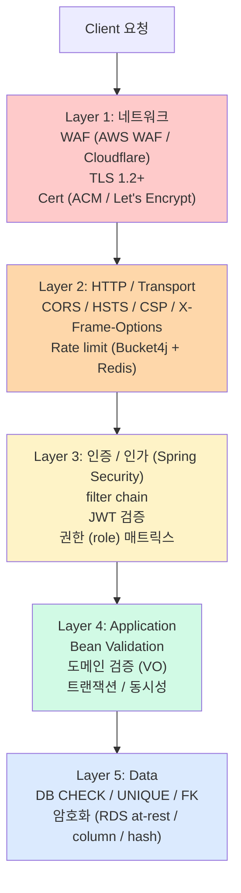

# auth §6 — 보안 (Hub)

**[[../signup|↑ signup hub]]**  ·  ← [[../domain-model/domain-model]]  ·  → [[../signup-impl]]

> auth 도메인의 보안 정책 / 구현. 어떤 사용자가 어떤 endpoint 호출할 수 있고, 데이터를 어떻게 보호하고, 어떤 공격을 어떻게 막는지.
> 정책 결정은 [[../design-decisions/design-decisions|design-decisions]]에서, 여기는 **구현 / 강제 수단**.

---

## 1. 이 폴더의 노트

| 노트 | 무엇 |
| --- | --- |
| [[authentication-authorization]] | 누가 어떤 endpoint 호출 가능 — Spring Security 의 filter chain / 권한 매트릭스 |
| [[sensitive-data-handling]] | 평문 password / PII 의 처리 — 로그 / 응답 / DB / toString 정책 |
| [[password-policy]] | NIST 800-63B 기준 길이 / 복잡도 / pwned check |
| [[attack-defense]] | enumeration / timing attack / rate limit / brute force / OWASP Top 10 매핑 |
| [[transport-security]] | HTTPS / HSTS / CORS / CSP / SecureHeaders / WAF |
| [[audit-logging]] | 누가 언제 어디서 — 보안 audit log |

---

## 2. 위협 모델 (Threat Model)

| 위협 | 어디서 막나 |
| --- | --- |
| 평문 password 노출 | [[sensitive-data-handling]] + [[password-policy]] |
| brute force (login 시도) | [[attack-defense]] (rate limit + lock) |
| 가입자 list enumeration | [[attack-defense]] (응답 통일 / rate limit) |
| 도난 토큰 사용 | [[../design-decisions/token-model]] (짧은 access + rotation + reuse detection) |
| SQL injection | JPA parameterized query (자동) |
| XSS | response escape + CSP ([[transport-security]]) |
| CSRF | CSRF token + SameSite cookie ([[transport-security]]) |
| 도청 (network) | TLS 1.2+ ([[transport-security]]) |
| 봇 / DDoS | WAF + CAPTCHA + rate limit |

---

## 3. 보안 layer

→ **다층 방어**. 한 layer 우회 시 다음 layer 가 잡음.

---

## 4. 시작 체크리스트

- [ ] HTTPS 강제 (HTTP → 301 리디렉션)
- [ ] HSTS 헤더 (`max-age=31536000`)
- [ ] CORS 화이트리스트 (origin 명시)
- [ ] CSP 헤더
- [ ] X-Content-Type-Options / X-Frame-Options
- [ ] Spring Security STATELESS
- [ ] JWT secret 256-bit + KMS
- [ ] Argon2id 파라미터 검증
- [ ] Rate limit (signup / login / password-reset)
- [ ] Audit log (login / signup / password change)
- [ ] WAF (AWS WAF / Cloudflare)
- [ ] Sentry / monitoring (보안 이벤트 알람)

---

## 5. 관련

- [[../signup|↑ signup hub]]
- [[../design-decisions/design-decisions]] — 정책 결정
- [[../../common/security-config]] — Spring SecurityConfig 표준 패턴
- [[../../pitfalls]] — 보안 관련 함정
