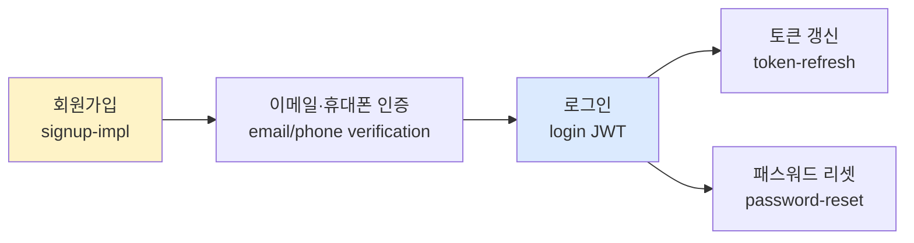
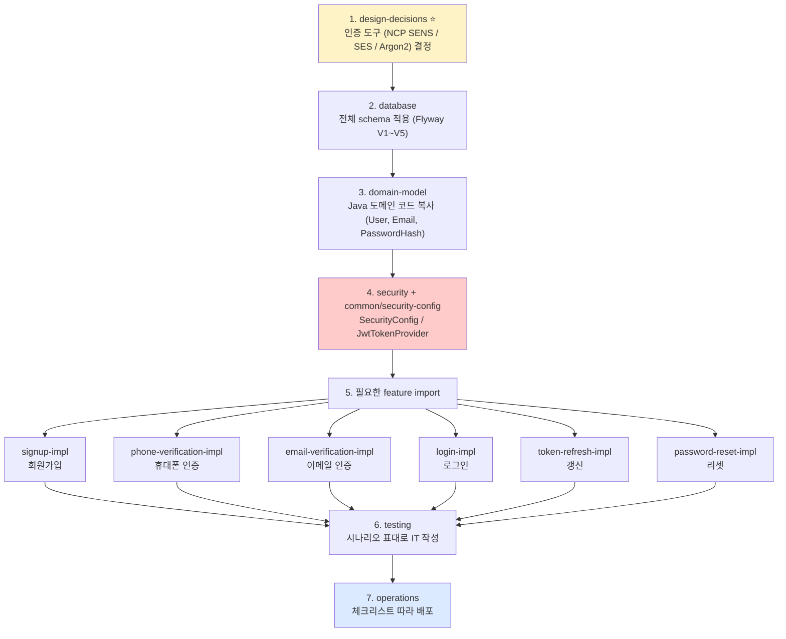
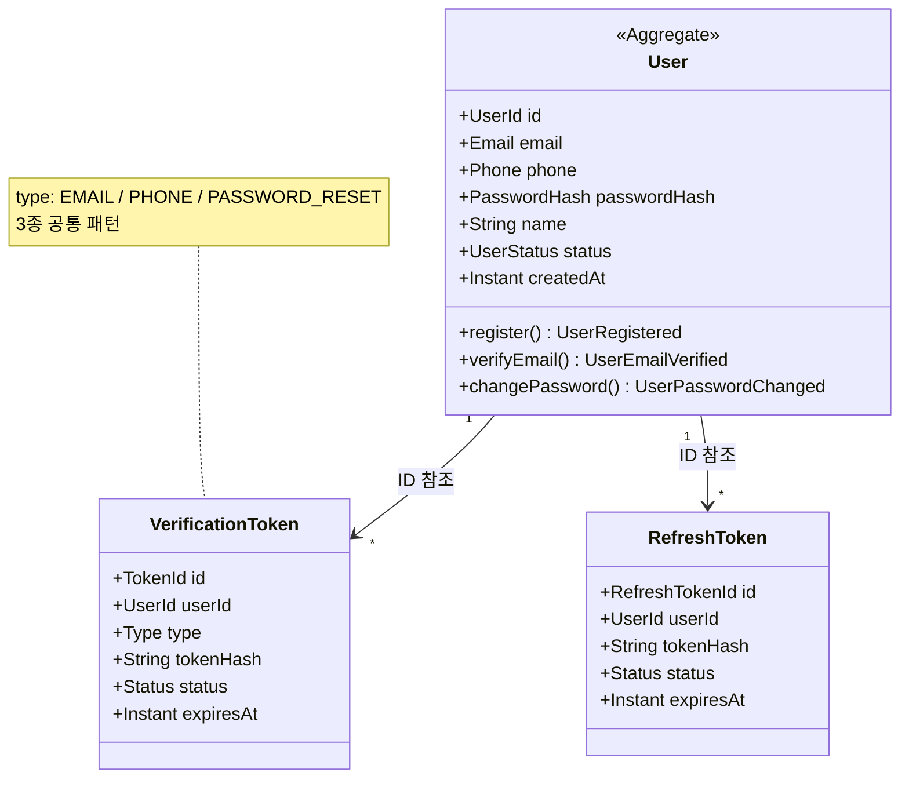
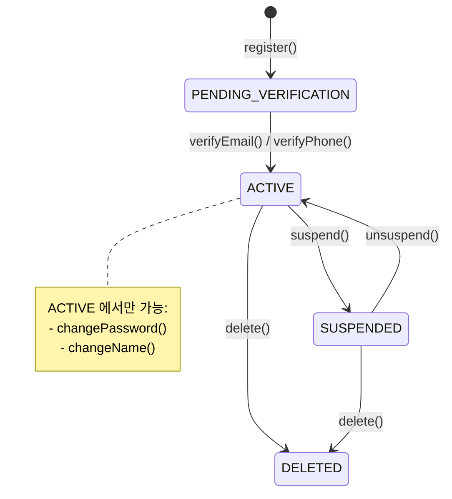

# 회원가입 + 로그인 + 인증 — Hub (auth 통합)

| 문서 버전 | 작성일 | 작성자 | 주요 변경 사항 |
| --- | --- | --- | --- |
| v.3.0.0 | 2026-05-14 | engineering-agent/tech-lead | auth 통합 — login / email-verify / phone-verify / password-reset 흡수 + 권장 도구 가이드 |
| v.2.0.0 | 2026-05-14 | engineering-agent/tech-lead | 폴더 split (12 detail) |
| v.1.0.0 | 2026-05-14 | engineering-agent/tech-lead | 단일 파일 (deprecated) |

**[[../api-design|↑ api-design hub]]**

> 📐 **ORM**: §implementation 들의 영속 코드는 JPA Adapter sketch. 3 모드 정책: [[../api-design#0.5 ORM 정책]].
> ORM 변형 본거지 — JPA: [[../../database/jpa#11.5.1]] · MyBatis: [[../../database/mybatis#10.5.1]] · 공존: [[../../database/jpa-mybatis-coexist#9.5.1]]
> 공통 패턴: [[../../common/response-envelope]] · [[../../common/security-config]]

---

## 1. 무엇이 이 폴더의 범위인가

**회원가입부터 시작하는 auth 전체 흐름** 의 production-grade 구현. **이 폴더 하나만 복사해서 몇 가지 설정 / 비즈니스 정책만 조정하면 바로 운영 가능** 을 목표.



---

## 2. 어떤 순서로 봐야 하나 (순차 가이드)

> "**위에서부터 차례대로**" 읽으면 — 설계 / 의사결정 → 도메인 / DB → 구현 → 운영 순서로 정렬되어 있어 **개발 단계를 그대로 따라갈 수 있음**.

### Phase 1 — 설계 / 의사결정 (먼저 결정해야 할 것)

| 순 | 노트 | 무엇을 결정 |
| --- | --- | --- |
| 1 | [[overview]] | 전체 auth 흐름 / 어떤 endpoint 가 필요한지 |
| 2 | [[prerequisites]] | 전제 / 범위 / 과한 적용 기준 |
| 3 | [[requirements]] | 요구사항 + 완료 조건 (Acceptance Criteria) |
| 4 | [[design-decisions]] ⭐ | **권장 도구 가이드** — 이메일 / SMS / 패스워드 / JWT / 소셜 / 2FA |

### Phase 2 — 기반 (DB & 도메인)

| 순 | 노트 | 무엇을 만들지 |
| --- | --- | --- |
| 5 | [[database]] | DB 스키마 (users + refresh_tokens + verification + reset / 약관) |
| 6 | [[domain-model]] | 도메인 모델 (Aggregate + Value Object + 상태 전이) |
| 7 | [[architecture]] | 계층 / Port·Adapter |
| 8 | [[security]] | 인증·인가 정책 / 암호화 / OWASP |

### Phase 3 — 기능별 구현

| 순   | 노트                          | 무엇                                       |
| --- | --------------------------- | ---------------------------------------- |
| 9   | [[signup-impl]]             | 회원가입 구현                                  |
| 10  | [[email-verification-impl]] | 이메일 인증                                   |
| 11  | [[phone-verification-impl]] | 휴대폰 인증 (한국 SaaS — AlimTalk / NCP SENS 등) |
| 12  | [[login-impl]]              | 로그인 (JWT access + refresh)               |
| 13  | [[token-refresh-impl]]      | 토큰 갱신 (rotation + reuse detection)       |
| 14  | [[password-reset-impl]]     | 패스워드 리셋                                  |

### Phase 4 — 운영 품질

| 순 | 노트 | 무엇 |
| --- | --- | --- |
| 15 | [[transactions]] | 트랜잭션 / 동시성 / 멱등성 |
| 16 | [[testing]] | 테스트 시나리오 + 단위 + 통합 |
| 17 | [[operations]] | 배포 / 로그 / 메트릭 / 알림 / 롤백 |

### Phase 5 — Reference

| 순 | 노트 | 무엇 |
| --- | --- | --- |
| 18 | [[implementation-order]] | 단계별 PR 분할 to-do |
| 19 | [[pitfalls]] | 흔한 함정 (코드 리뷰 체크리스트) |

---

## 3. "바로 사용" 흐름 — 어디부터 손대나

가장 일반적인 한국 SaaS 시나리오 (이메일/패스워드 + 휴대폰 인증) 기준:



→ **모든 feature 코드는 같은 도메인 모델 + 같은 응답 envelope 위에 동작**. 추가 작업이 최소화.

---

## 4. 한 페이지 cheat sheet

### 4.1 전체 endpoint

```
# 회원가입
POST   /api/v1/auth/signup
POST   /api/v1/auth/signup/social                 (Apple/Google/Kakao/Naver)

# 인증 (verification)
POST   /api/v1/auth/verify/email/request          (인증 메일 발송)
POST   /api/v1/auth/verify/email/confirm          (메일의 토큰 검증)
POST   /api/v1/auth/verify/phone/request          (SMS 인증번호 발송)
POST   /api/v1/auth/verify/phone/confirm          (인증번호 검증)

# 로그인
POST   /api/v1/auth/login
POST   /api/v1/auth/login/social

# 토큰
POST   /api/v1/auth/token/refresh                  (rotation)
POST   /api/v1/auth/logout                          (refresh 무효)

# 패스워드
POST   /api/v1/auth/password-reset/request
POST   /api/v1/auth/password-reset/confirm

# 현재 사용자
GET    /api/v1/me
```

### 4.2 도메인 객체



### 4.3 status 머신



### 4.4 권장 도구 (자세히는 [[design-decisions]])

| 영역 | 권장 |
| --- | --- |
| 패스워드 해시 | **Argon2id** (m=64MB, t=3, p=4) |
| JWT | **HS256** (단일 서비스) / RS256 (MSA) |
| 이메일 발송 | **AWS SES** (싸고 안정) / SendGrid (배달율) |
| SMS 발송 (국내) | **NCP SENS** / **AlimTalk** (카카오) |
| 휴대폰 본인인증 | **PASS** (실명 인증) / **NICE** |
| 소셜 로그인 | Apple / Google / Kakao / Naver (한국) |
| 2FA | TOTP (Google Authenticator) |

---

## 5. 관련

- [[../oauth2-social-login]] — 소셜 가입 / 로그인 깊이
- [[../two-factor-auth]] — 2FA (TOTP)
- [[../rbac-permissions]] — 가입 후 권한
- [[../rate-limiting]] — 가입 / 로그인 brute force 방어
- [[../../../../database/postgresql/security|↗ PG 보안]]
- [[../../../../security/security|↗ security hub]]
- [[../api-design|↑ api-design hub]]
