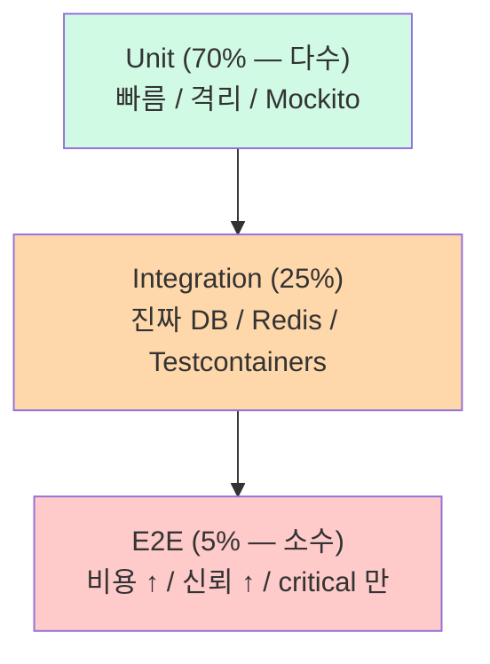

# auth §10 — 테스트 (Hub)

**[[../signup|↑ signup hub]]**  ·  ← [[../transactions]]  ·  → [[../operations]]

> 테스트 종류 / 시나리오 / pyramid. "어떻게 검증할 것인가" 의 의사결정.
> 부실하면 **회귀 침몰, 운영 사고 시 원인 추적 X, 신규 합류자 confidence ↓**.

---

## 1. 이 폴더의 노트

| 노트 | 무엇 |
| --- | --- |
| [[unit-tests]] | 도메인 / VO / Aggregate / Application service 단위 테스트 |
| [[integration-tests]] | Controller + DB + Testcontainers / Repository |
| [[test-scenarios]] | 시나리오 표 (필수 / 권장 / 옵션) + Given-When-Then |
| [[test-data-fixtures]] | TestUserBuilder / common fixtures / DB setup |

---

## 2. Test Pyramid



### 2.1 본 vault 의 비율

| Type | 비율 | 도구 |
| --- | --- | --- |
| Unit | 70% | JUnit 5 + Mockito + AssertJ |
| Integration | 25% | SpringBootTest + Testcontainers |
| E2E | 5% | REST Assured + 실 환경 |

**왜 이 비율**
- Unit = 빠름 (수 ms) + 격리 + 회귀 빨리 발견.
- Integration = 진짜 통합 (JPA + DB) 검증.
- E2E = 비싸지만 사용자 흐름 검증 — critical path 만.

---

## 3. 시나리오 우선순위

| 우선순위 | 의미 | 시점 |
| --- | --- | --- |
| 🔴 必 | 출시 전 통과 필수 | PR 머지 전 |
| 🟡 권장 | 권장 (점진 추가) | sprint 안 |
| 🟢 옵션 | 시간 되면 | 안정 후 |

자세히: [[test-scenarios]].

---

## 4. 테스트 환경

### 4.1 Unit Test

```yaml
spring.profiles.active: unit
spring.test.context.cache.maxSize: 32
```

- in-memory (자체 객체).
- DB / Redis / 외부 X.

### 4.2 Integration Test

```yaml
spring.profiles.active: test
spring.flyway.enabled: true
```

- Testcontainers (PostgreSQL / Redis).
- 매 테스트 클래스마다 deep clean.

### 4.3 E2E Test

```yaml
spring.profiles.active: e2e
```

- staging 환경 또는 docker-compose 로 전체 stack.
- 실 외부 API (SES / SMS) 의 mock / sandbox.

---

## 5. 왜 H2 in-memory 안 됨

| H2 | PostgreSQL (Testcontainers) |
| --- | --- |
| in-memory — 빠름 (ms) | 컨테이너 — 수 초 시작 |
| PG-specific 기능 미지원 (`lower(email)` 표현식 인덱스, JSONB) | 실제 동작 |
| CHECK 제약 일부 미지원 | 그대로 |
| Flyway PG 마이그레이션 호환 X | 호환 |
| `time_zone` 처리 다름 | PG 그대로 |

**구체적 함정**
- H2 에서 통과한 테스트가 prod 에서 fail.
- `lower(email)` UNIQUE 가 H2 의 일부 모드에서 다르게 동작.
- 본 vault: **무조건 Testcontainers** (Integration 테스트).

---

## 6. 테스트 수 가이드

| 도메인 영역 | Unit | Integration | E2E |
| --- | --- | --- | --- |
| User Aggregate (도메인) | 10+ | 0 | 0 |
| VO (Email, Password, ...) | 각 5+ | 0 | 0 |
| SignupUseCase | 8+ | 3 | 1 (E2E) |
| LoginUseCase | 8+ | 3 | 1 |
| Controller | 5 | 5 | 0 |
| Repository | 0 | 5+ | 0 |

→ **분량은 결정에 따라**. 본 vault 의 default 분포.

---

## 7. 시작 체크리스트

- [ ] JUnit 5 + AssertJ + Mockito 의존성
- [ ] Testcontainers PostgreSQL 16
- [ ] REST Assured (E2E)
- [ ] Flyway 가 test 환경에서 정상 실행
- [ ] 테스트 user fixtures (TestUserBuilder)
- [ ] CI 가 모든 layer 실행 (Unit + Integration)
- [ ] Coverage 측정 (JaCoCo) + 목표 (도메인 90%+, application 80%+)

---

## 8. 관련

- [[../signup|↑ signup hub]]
- [[../transactions]] — 이전 (§9)
- [[../operations]] — 다음 (§11)
- [[../../testing/integration-tests]] — Testcontainers 패턴
