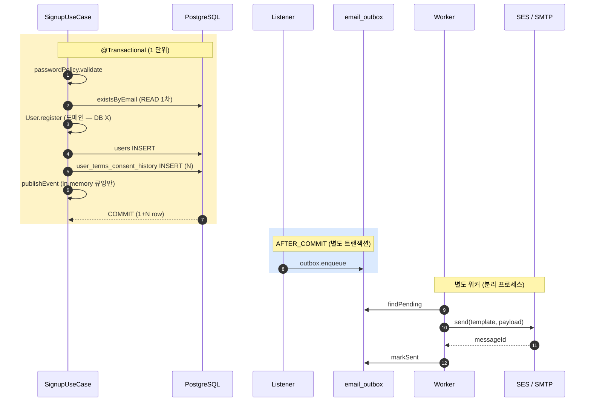
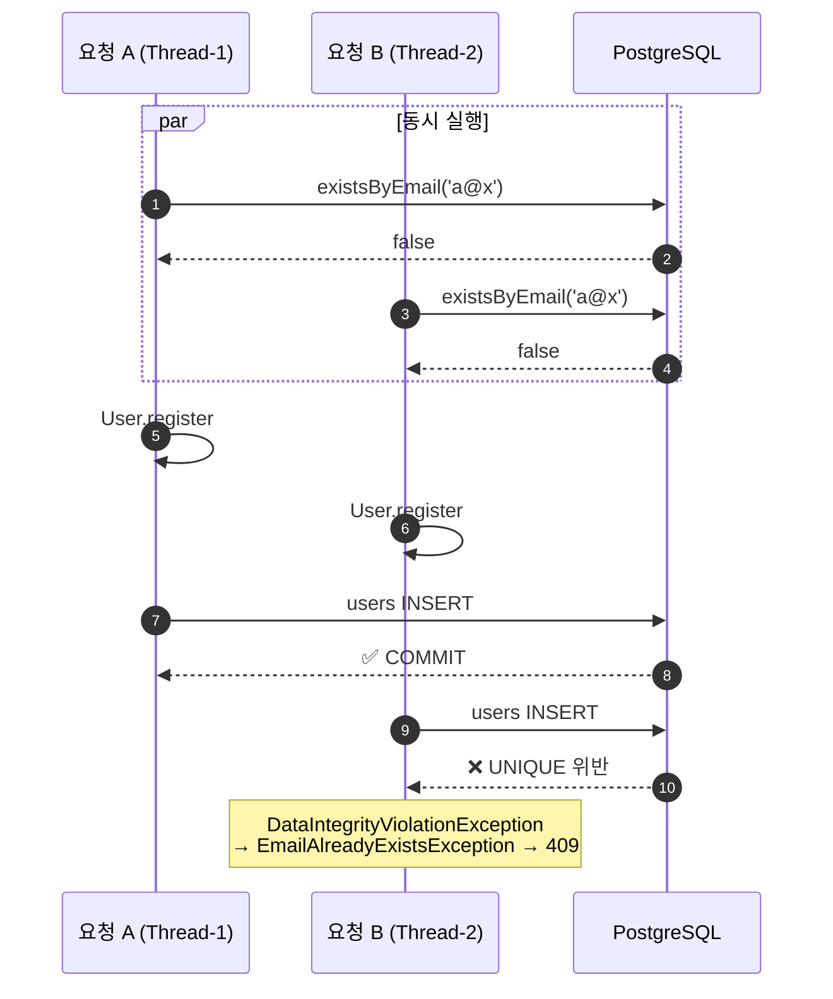

# signup §7 — 트랜잭션 / 예외 / 검증 / 동시성 / 멱등성

**[[signup|↑ signup hub]]**  ·  ← [[implementation]]  ·  → [[testing]]

---

## 1. 트랜잭션 경계



### 1.1 트랜잭션 범위 — 왜 이 범위인가

| 포함 | 제외 | 이유 |
| --- | --- | --- |
| `users` INSERT | SMTP 호출 | 외부 IO 가 트랜잭션 안에 = 락 시간 ↑ |
| `user_terms_consent_history` INSERT | 이메일 outbox row INSERT | 같은 트랜잭션 인지 별도 인지는 정책 — 본 레시피는 `AFTER_COMMIT` 으로 분리 |
| `users` 와 `terms` 의 일관성 | Kafka / external API | trans 일관성 vs 외부 → 후자 fail-and-forget |

### 1.2 `readOnly = true` 사용

`signup.handle` 은 write — `readOnly = false` (기본). 단순 read 조회 메서드 (예: `findByEmail`) 만 `readOnly = true` 권장.

---

## 2. 예외 매핑

| 도메인 / 응용 예외 | HTTP | code | 메시지 |
| --- | --- | --- | --- |
| `EmailAlreadyExistsException` (`BusinessException`) | 409 | `BADREQ_004` | "이미 가입된 이메일입니다." |
| `BusinessException(INVALID_INPUT_FORMAT, ...)` (PasswordPolicy / 약관) | 422 | `BADREQ_002` | "password length must be 8-128" 등 |
| `IllegalArgumentException` (도메인 Value Object) | 400 | `BADREQ_001` | "invalid email: ..." |
| `MethodArgumentNotValidException` (Bean Validation) | 422 | `BADREQ_002` | field 별 메시지 |
| `DataIntegrityViolationException` (UNIQUE / FK 위반) | 409 | `CONFLT_001` | "리소스 상태 충돌" |
| `Exception` (캐치올) | 500 | `INTERNAL_ERR_001` | "서버 내부 오류" (디버그 메시지 노출 X) |

→ 매핑은 [[../../common/response-envelope#6 ApiExceptionHandler]] 의 표준 그대로.

> **함정**: SignupUseCase 가 `try { users.save } catch (DataIntegrityViolationException)` 으로 변환했지만 — 다른 경로 (예: `name` 의 trigger violation) 가 있을 수 있음. **handler 단에도 기본 매핑 유지** (이중 안전망).

---

## 3. Bean Validation

```java
public record SignupRequest(
    @Email @NotBlank @Size(max = 254) String email,
    @NotBlank @Size(min = 8, max = 128) String password,
    @NotBlank @Size(max = 100) String name,
    @AssertTrue(message = "must agree to terms") boolean termsAgreed,
    boolean marketingAgreed
) { ... }
```

| 어노테이션 | 의미 |
| --- | --- |
| `@Email` | RFC 5322 형식 |
| `@NotBlank` | null / 빈 문자열 / 공백만 거절 |
| `@Size(max=254)` | 길이 제한 |
| `@AssertTrue` | boolean 이 true 일 때만 통과 |
| `@Valid` | Controller 메서드 인자에 — 중첩 객체 까지 검증 트리거 |

**Bean Validation 의 한계**:
- 비즈니스 룰 (유출 패스워드 등) 검증 X — `PasswordPolicy` 가 보강
- `@Email` 이 너무 관대 — 도메인 `Email` value object 가 다시 검증

→ **3중 방어**: Bean Validation → Domain Value Object → DB constraint.

---

## 4. 동시성

### 4.1 시나리오 — 같은 이메일 2 요청



→ **1차 application 검증은 친절한 UX 메시지**, **DB UNIQUE 가 진실의 원천**.

### 4.2 방어 — 코드 양식

```java
try {
    saved = users.save(user);
} catch (DataIntegrityViolationException e) {
    throw new EmailAlreadyExistsException(email);
}
```

### 4.3 비관 락 / 낙관 락 필요한가

signup 은 신규 INSERT 만 — 락 불필요. UNIQUE constraint 가 직렬화 보장.

후속 작업 (changePassword / verifyEmail) 에서는 `@Version` 낙관 락 활용:
```java
@Entity
class UserJpaEntity {
    @Version private long version;
}
```

동시 두 요청이 같은 user 의 status 변경 시 — 한쪽만 성공 + 다른쪽 `OptimisticLockException` → 재시도 또는 409.

### 4.4 외부 노이즈 — 트랜잭션 안의 외부 호출

```java
// ❌ 안티 — 트랜잭션 안에서 SMTP / PG / Kafka 호출
@Transactional
public User handle(...) {
    users.save(user);
    smtpClient.send(...);                   // 5초 timeout = DB 락 5초 hold
    kafkaClient.send(...);                  // ditto
}

// ✅ 표준 — 트랜잭션 밖에서 처리
@Transactional
public User handle(...) {
    users.save(user);
    events.publishEvent(new UserRegistered(...));   // in-memory 큐잉만
}
// AFTER_COMMIT listener 가 outbox 적재
// 별도 워커가 outbox → SMTP
```

→ **외부 IO 는 항상 AFTER_COMMIT** + **outbox 패턴**.

---

## 5. 멱등성 — `Idempotency-Key` (선택)

### 5.1 왜 필요한가

```
Client → POST /signup { email: 'a@x', ... }
              ↓
         Network retry (timeout 받았는데 사실 서버는 성공)
              ↓
        POST /signup { email: 'a@x', ... } 다시
              ↓
         Server: existsByEmail = true → 409 응답
              ↓
         Client: 이미 등록된 줄 알았는데 처음인데? 혼동
```

같은 클라가 같은 요청 2번 = 같은 결과 (200 + 같은 userId) 가 정상.

### 5.2 구현

```java
@PostMapping("/signup")
public ResponseEntity<CommonResponse<SignupResponse>> signup(
    @Valid @RequestBody SignupRequest req,
    @RequestHeader(value = "Idempotency-Key", required = false) String idempotencyKey
) {
    if (idempotencyKey != null) {
        var existing = idempotencyService.find(idempotencyKey);
        if (existing.isPresent()) {
            return ResponseEntity.ok(existing.get());          // 같은 응답
        }
    }

    var user = signupUseCase.handle(toCommand(req));
    var body = CommonResponse.success(...);

    if (idempotencyKey != null) {
        idempotencyService.save(idempotencyKey, body, Duration.ofHours(24));
    }
    return ResponseEntity.ok(body);
}
```

```java
@Service
@RequiredArgsConstructor
public class IdempotencyService {

    private final IdempotencyKeyRepository repo;
    private final Clock clock;

    public Optional<CommonResponse<?>> find(String key) {
        return repo.find(key)
            .filter(e -> e.expiresAt().isAfter(Instant.now(clock)))
            .map(e -> e.response());
    }

    public void save(String key, CommonResponse<?> response, Duration ttl) {
        try {
            repo.insert(new IdempotencyKeyRow(
                key, response, Instant.now(clock), Instant.now(clock).plus(ttl)
            ));
        } catch (DataIntegrityViolationException e) {
            // 같은 키 동시 — 무시 (먼저 들어간 응답이 진실)
        }
    }
}
```

### 5.3 DB

```sql
CREATE TABLE idempotency_keys (
    key          VARCHAR(50) PRIMARY KEY,
    response     JSONB NOT NULL,
    created_at   TIMESTAMPTZ NOT NULL,
    expires_at   TIMESTAMPTZ NOT NULL
);
CREATE INDEX ix_idempotency_expires ON idempotency_keys (expires_at);
```

만료된 key 는 매일 cleanup job.

### 5.4 정책 결정

| 옵션 | 설명 | 본 레시피 |
| --- | --- | --- |
| Idempotency 안 함 | 단순. 중복 = 409 | 신규 SaaS 초기 |
| Header optional | 클라가 보내면 멱등, 안 보내면 일반 | **권장** — 점진적 |
| Header required | 강제 | 결제 / 큰 비용 endpoint |

본 레시피: **optional**. 결제·주문 (큰 비용) 은 [[../payment-pg]] / [[../order-stock]] 에서 required.

---

## 6. 트랜잭션 / 격리 수준

| 수준 | signup 에 OK? |
| --- | --- |
| READ COMMITTED (PG / MySQL 기본) | ✅ |
| REPEATABLE READ | ✅ — 단 phantom read 무관 (단일 INSERT) |
| SERIALIZABLE | △ — 과한 락 (시리얼라이즈 실패 시 retry 필요) |

→ **기본 READ COMMITTED 그대로**.

---

## 7. 운영 함정 (요약 — 자세히는 [[pitfalls]])

- `@Transactional` 안에서 SMTP 호출 → 응답 시간 폭발
- DTO `toString()` 에 password 평문 → 로그 노출
- `existsByEmail` 만 의존 → race condition
- 트랜잭션 rollback 후에도 outbox 적재 (잘못된 listener phase) → 가입 실패 + 메일 발송 사고

---

## 8. 관련

- [[signup|↑ signup hub]]
- [[implementation]] — 이전 (§6)
- [[testing]] — 다음 (§8)
- [[pitfalls]] — 함정 모음 (§11)
- [[../../pitfalls/transaction-pitfalls]] (예정)
- [[../../pitfalls/concurrency-pitfalls]] (예정)
