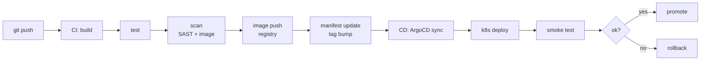

# CI/CD — 도구 선택 / pipeline / GitOps

| 문서 버전 | 작성일 | 작성자 | 주요 변경 사항 |
| --- | --- | --- | --- |
| v1.0.0 | 2026-05-15 | engineering-agent/tech-lead | 최초 — hub + 도구 비교 + 실습 |

**[[../devops|↑ devops]]**

---

## 0. 왜 CI/CD

| 질문 | 답 |
| --- | --- |
| 왜 CI? | 코드 push → 자동 build + test → 빠른 피드백 |
| 왜 CD? | 자동 배포 → 사람 개입 ↓ → release 빠르게 |
| 왜 GitOps? | git = source of truth → audit / rollback 쉬움 |

---

## 1. 영역

| 노트 | 내용 |
| --- | --- |
| [[tools-comparison]] ★ | GH Actions / GitLab CI / Jenkins / CircleCI / Buildkite / Tekton |
| [[github-actions]] ★ | 가장 인기 (OSS / SaaS) |
| [[gitlab-ci]] | GitLab 통합 |
| [[jenkins]] | self-hosted / enterprise |
| [[circleci]] | SaaS — 빠른 시작 |
| [[buildkite]] | self-hosted agent + SaaS UI |
| [[tekton]] | k8s-native |
| [[argocd-cd]] | GitOps CD (k8s) |
| [[flux-cd]] | GitOps CD (k8s, lightweight) |
| [[pipeline-patterns]] ★ | build / test / scan / deploy 표준 흐름 |
| [[secret-in-pipeline]] | secret 안전한 관리 |
| [[caching]] | dependency / build cache |
| [[matrix-builds]] | OS / 언어 버전 매트릭스 |
| [[release-strategies]] | semver / tag / changelog |
| [[pitfalls]] | 흔한 함정 |
| [[practice/practice]] ★ | 실습 |

---

## 2. 도구 선택 표

| 환경 | 추천 |
| --- | --- |
| **GitHub repo + 시작** | GitHub Actions ★ |
| **GitLab repo** | GitLab CI ★ |
| **self-hosted / enterprise** | Jenkins / GitLab CI self-hosted |
| **빠른 SaaS** | CircleCI |
| **분산 agent + monorepo** | Buildkite |
| **k8s-native** | Tekton + ArgoCD |
| **GitOps CD** | ArgoCD ★ (UI) / Flux (lightweight) |

자세히: [[tools-comparison]].

---

## 3. 표준 pipeline 흐름

자세히: [[pipeline-patterns]].

---

## 4. 본 vault 권장 stack

| 단계 | stack |
| --- | --- |
| MVP (1주) | GitHub Actions: build → docker push GHCR → ssh deploy |
| 3개월 | + Trivy scan + Terraform plan/apply |
| 1년 (k8s) | + ArgoCD + Helm + GitOps repo 분리 |
| 3년+ | + Argo Rollouts (canary) + 자체 backstage / IDP |

---

## 5. cheat sheet

| 도구 | 핵심 명령 / file |
| --- | --- |
| GitHub Actions | `.github/workflows/*.yml` |
| GitLab CI | `.gitlab-ci.yml` |
| Jenkins | `Jenkinsfile` |
| CircleCI | `.circleci/config.yml` |
| Buildkite | `.buildkite/pipeline.yml` |
| Tekton | k8s CRD (`PipelineRun`) |
| ArgoCD | `Application` CRD |
| Flux | `Kustomization` / `HelmRelease` CRD |

---

## 6. 관련

- [[../devops|↑ devops]]
- [[../docker/docker|↗ docker (build)]]
- [[../kubernetes/kubernetes|↗ k8s (deploy)]]
- [[../iac/iac|↗ iac (infra)]]
