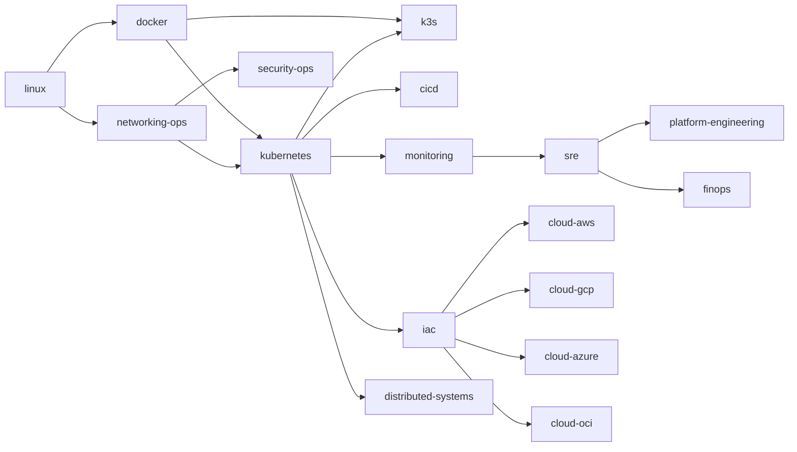

# DevOps 학습 가이드라인 — competency 정의 / 산출물 / 검증

**[[devops|↑ devops]]**

---

## 1. 목적

본 문서는 vault 의 `20-areas/devops` 하위 노트들이 어떤 학습 단계 / 산출물 / 검증 기준을 충족해야 하는지를 정의하는 **참조 가이드라인** 이다.

본 문서가 정의하는 것:
- DevOps 영역의 13 도메인 분류 와 의존 관계
- 각 도메인 별 competency level (foundational / operational / architectural) 의 정의
- 각 level 의 학습 항목 / 산출물 / 검증 기준
- vault 노트 종류 별 작성 표준

본 문서가 정의하지 않는 것:
- 개별 도구의 사용법 (각 도메인의 concepts / mental-models / deep 노트가 담당)
- 개인 학습 일정 / 시간 배분
- 사람 별 평가 / 면접 절차

---

## 2. 범위

대상:
- vault 의 `20-areas/devops/` 하위 모든 노트.
- 외부 도구 (CKA / Linux Foundation curriculum) 와 매핑은 §10 의 표 기준.

비 대상:
- 언어 / 프레임워크 (`20-areas/backend` 등 다른 영역).
- 회사 / 프로젝트 한정 운영 절차 (`10-projects/<project>/` 에 둠).

---

## 3. 용어

| 용어 | 정의 |
| --- | --- |
| **도메인 (domain)** | DevOps 영역 안의 독립적인 책임 단위. 본 vault 의 13 개. |
| **competency** | 한 도메인에 대해 정의된 측정 가능한 능력 정의. |
| **level** | competency 의 깊이 단계. `foundational` / `operational` / `architectural` 3 단계. |
| **산출물 (artifact)** | level 충족을 증명하는 구체적 결과물 (vault 노트 / 실습 환경 / 설정 파일 등). |
| **검증 기준 (criteria)** | 산출물이 level 을 충족했는지 판단하는 객관적 조건. |
| **노트 종류 (note kind)** | vault 노트의 역할 분류. §9 의 7 종. |

---

## 4. 도메인 분류

DevOps 영역은 다음 13 개 도메인으로 분류된다. 분류 기준은 운영 책임의 독립성이며, 노트 디렉터리 구조 (`20-areas/devops/<domain>/`) 와 1:1 매핑된다.

### 4.1 Foundation (4)

| 도메인 | 디렉터리 | 책임 범위 |
| --- | --- | --- |
| linux | `linux/` | 커널 / 프로세스 / 파일시스템 / 네트워크 스택 / systemd |
| docker | `docker/` | container 빌드 / 실행 / image / volume / network |
| nginx | `nginx/` | reverse proxy / TLS termination / 정적 서빙 |
| networking-ops | `networking-ops/` | DNS / LB / CDN / TLS / 네트워크 정책 |

### 4.2 Orchestration (2)

| 도메인 | 디렉터리 | 책임 범위 |
| --- | --- | --- |
| kubernetes | `kubernetes/` | 표준 k8s 의 리소스 / 컨트롤 플레인 / 운영 |
| k3s | `k3s/` | 경량 k8s 의 아키텍처 / 적용 시나리오 / 운영 |

### 4.3 Cloud (4)

| 도메인 | 디렉터리 | 책임 범위 |
| --- | --- | --- |
| cloud-aws | `cloud-aws/` | AWS 서비스 / IAM / VPC / 매니지드 |
| cloud-azure | `cloud-azure/` | Azure 동등 |
| cloud-gcp | `cloud-gcp/` | GCP 동등 |
| cloud-oci | `cloud-oci/` | OCI 동등 |

### 4.4 Automation (2)

| 도메인 | 디렉터리 | 책임 범위 |
| --- | --- | --- |
| cicd | `cicd/` | 빌드 / 테스트 / 배포 파이프라인 |
| iac | `iac/` | Terraform / Pulumi / Ansible / 상태 관리 |

### 4.5 Operations (4)

| 도메인 | 디렉터리 | 책임 범위 |
| --- | --- | --- |
| monitoring | `monitoring/` | metric / log / trace / alert |
| sre | `sre/` | SLO / 에러 예산 / incident / postmortem |
| security-ops | `security-ops/` | secret / mTLS / supply chain / SBOM |
| platform-engineering | `platform-engineering/` | IDP / 골든 패스 / 개발자 셀프 서비스 |

### 4.6 보조 도메인 (3)

| 도메인 | 디렉터리 | 책임 범위 |
| --- | --- | --- |
| distributed-systems | `distributed-systems/` | consensus / CAP / replication |
| performance | `performance/` | 부하 / 병목 / 프로파일 |
| finops | `finops/` | 비용 가시화 / 최적화 / commit |
| mlops | `mlops/` | 모델 서빙 / 학습 파이프라인 (선택) |
| data-engineering | `data-engineering/` | 스트림 / 배치 / 스토리지 (선택) |

---

## 5. 도메인 의존 그래프

각 도메인 학습 시 선행 도메인 충족 가정.

선행 도메인의 `foundational` competency 미충족 시 본 도메인 학습 권장하지 않음.

---

## 6. Competency level 정의

도메인별 competency 는 다음 3 단계로 정의한다.

### 6.1 Foundational

도메인의 핵심 리소스 / 용어 / 기본 명령에 대한 정의를 진술할 수 있고, 단일 노드 / 단일 환경에서 동작 가능한 최소 구성을 만들 수 있다.

### 6.2 Operational

도메인의 production 운영에 필요한 설정 / 모니터링 / 장애 대응 절차를 수립할 수 있고, 흔한 실패 모드의 1차 원인 분석을 단독으로 수행할 수 있다.

### 6.3 Architectural

도메인의 적용 여부 / 대안 / 트레이드오프를 비교 정의할 수 있고, multi-team / multi-region / cost-bound 환경에서 도메인 선택의 근거를 문서화 할 수 있다.

→ 각 level 은 다음 산출물과 검증 기준으로 충족 여부를 판단한다.

---

## 7. 도메인 × level 산출물 매트릭스

각 셀의 산출물이 vault 에 존재하고 검증 기준을 만족할 때 해당 level 충족으로 간주한다.

### 7.1 linux

| level | 산출물 | 검증 기준 |
| --- | --- | --- |
| foundational | [[linux/shell-basics]], [[linux/file-permissions]], [[linux/process-management]], [[linux/systemd]] 노트 + 1 개 systemd unit 실습 | 30 essential 명령 정의 + 1 개 unit file 작성·실행 |
| operational | [[linux/networking-basics]], [[linux/performance-troubleshooting]], [[linux/ssh]] + tcpdump / strace / perf 1 회 적용 | CPU / memory / IO / network 4 축 troubleshooting flow 진술 |
| architectural | [[linux/linux-mental-models-for-devops]] + [[linux/pitfalls]] + 1 건의 production root cause 분석 노트 | namespace / cgroup / page cache / scheduler 의 4 모델을 도메인 (docker / k8s) 과 cross-link |

### 7.2 docker

| level | 산출물 | 검증 기준 |
| --- | --- | --- |
| foundational | [[docker/concepts]], [[docker/dockerfile-best-practices]] + [[docker/practice/01-hello-world]] | 5 핵심 개념 (image/container/layer/volume/network) 진술 |
| operational | [[docker/compose]], [[docker/networking]], [[docker/volume]], [[docker/registry]] + [[docker/practice/03-compose-full-stack]] | multi-service compose 운영 + private registry push 절차 |
| architectural | [[docker/docker-mental-models]], [[docker/production-patterns]], [[docker/security]], [[docker/buildkit-deep]], [[docker/pitfalls]], [[docker/runtime-comparison]] | image 크기 / build time 최적화 결정 근거 + runtime (containerd / cri-o / Docker) 선택 근거 |

### 7.3 networking-ops

| level | 산출물 | 검증 기준 |
| --- | --- | --- |
| foundational | [[networking-ops/osi-model]], [[networking-ops/dns]], [[networking-ops/load-balancer-types]] | record 유형 / LB type 4 분류 / TLS handshake 단계 진술 |
| operational | [[networking-ops/ssl-tls-ops]], [[networking-ops/network-policy]], [[networking-ops/api-gateway]], [[networking-ops/waf]] | cert auto-rotation 절차 + NetworkPolicy 1 건 작성 |
| architectural | [[networking-ops/dns-provider-architecture]], [[networking-ops/cni-deep]], [[networking-ops/service-mesh]], [[networking-ops/cdn]], [[networking-ops/bgp-anycast]], [[networking-ops/multi-region-networking]] | DNS provider / CNI / service mesh 선택 trade-off 비교 표 작성 |

### 7.4 kubernetes

| level | 산출물 | 검증 기준 |
| --- | --- | --- |
| foundational | [[kubernetes/concepts]], [[kubernetes/deployments]], [[kubernetes/services-networking]], [[kubernetes/configmaps-secrets]] | 10 핵심 리소스 진술 + Deployment + Service + Ingress 1 세트 |
| operational | [[kubernetes/helm]], [[kubernetes/ingress-controllers]], [[kubernetes/rbac]], [[kubernetes/autoscaling]], [[kubernetes/storage]], [[kubernetes/debugging]] | HPA / VPA / PDB 설정 + RBAC role / binding 1 세트 + CrashLoop 디버깅 절차 |
| architectural | [[kubernetes/kubernetes-mental-models]], [[kubernetes/operator-pattern]], [[kubernetes/admission-webhook-deep]], [[kubernetes/gitops-argocd]], [[kubernetes/managed-vs-self-hosted]], [[kubernetes/advanced-scheduling]], [[kubernetes/pitfalls]] | control plane / scheduler / operator 모델 진술 + managed vs self-hosted 결정 표 |

### 7.5 k3s

| level | 산출물 | 검증 기준 |
| --- | --- | --- |
| foundational | [[k3s/concepts]], [[k3s/installation]], [[k3s/practice/01-single-node-bootstrap]] | single-binary 아키텍처 진술 + 1 노드 부트스트랩 |
| operational | [[k3s/networking]], [[k3s/storage]], [[k3s/upgrade-strategy]], [[k3s/backup-restore]] | kine / SQLite backup + upgrade 절차 |
| architectural | [[k3s/k3s-when-and-how]], [[k3s/ha-mode]], [[k3s/k3d-multi-cluster]], [[k3s/edge-usecases]], [[k3s/gitops]], [[k3s/migration]], [[k3s/production-checklist]], [[k3s/pitfalls]] | k3s 적용 시나리오 결정 표 + k8s 마이그레이션 임계 조건 정의 |

### 7.6 cicd

| level | 산출물 | 검증 기준 |
| --- | --- | --- |
| foundational | [[cicd/cicd]] hub + GitHub Actions / GitLab CI 1 파이프라인 | build → test → image push 단일 파이프라인 |
| operational | secret 관리 / multi-env deploy / matrix build / artifact retention | 동일 파이프라인에 환경별 promote 정의 |
| architectural | GitOps (ArgoCD / Flux) / progressive delivery / DORA metric | pull vs push 모델 trade-off + DORA 4 지표 측정 절차 |

### 7.7 iac

| level | 산출물 | 검증 기준 |
| --- | --- | --- |
| foundational | Terraform module 1 개 (VPC / EC2 / SG) | apply / destroy / plan 의 idempotency 확인 |
| operational | remote state / state lock / workspace / module registry | 다중 환경 state 분리 |
| architectural | Terraform vs Pulumi vs CDK / drift detection / policy-as-code (OPA) | IaC 선택 trade-off + drift 검출 절차 |

### 7.8 monitoring · sre

| level | 산출물 | 검증 기준 |
| --- | --- | --- |
| foundational | Prometheus + Grafana 1 dashboard | metric exporter + scrape 설정 |
| operational | PromQL alert rule + Loki log + OpenTelemetry trace | 4 골든 시그널 (latency / traffic / errors / saturation) 대시보드 |
| architectural | SLO 정의 + error budget + incident response + postmortem | SLO 1 건 + alert routing 절차 + 1 건 postmortem |

### 7.9 cloud / security-ops / platform-engineering / finops

| 도메인 | foundational | operational | architectural |
| --- | --- | --- | --- |
| cloud-* | 기본 서비스 (compute / storage / network / DB / IAM) 진술 | multi-AZ HA + IAM 최소 권한 + VPC 분리 | multi-region + cost / latency trade-off + landing zone |
| security-ops | secret 관리 (Vault / KMS / sealed-secrets) | mTLS / SBOM / image scan / RBAC audit | zero-trust / SPIFFE / supply chain (SLSA) |
| platform-engineering | dev 환경 셀프 서비스 (terraform module 카탈로그) | IDP (Backstage) + 골든 패스 | platform SLA / tenant 모델 / cost allocation |
| finops | tag / cost report | rightsizing / spot / reserved | unit economics / showback / chargeback |

---

## 8. 학습 진행 절차

본 가이드라인은 시간 일정을 정의하지 않는다. 다만 다음 절차를 권장한다.

1. **도메인 선정** — §5 의존 그래프에서 선행 도메인이 충족된 도메인만 선택.
2. **노트 정독** — 선택한 도메인의 hub (`<domain>.md`) → `concepts.md` → mental-models / deep → pitfalls 순.
3. **실습 수행** — `practice/` 하위 노트의 실습 절차 수행 + 결과를 troubleshooting 노트로 기록.
4. **산출물 작성** — §7 의 해당 level 산출물 작성 또는 갱신.
5. **검증** — §7 의 검증 기준을 자체 검토 또는 동료 리뷰.

---

## 9. 노트 종류 표준

vault 의 도메인 디렉터리는 다음 7 종 노트로 구성된다. 도메인마다 모든 종류가 필수는 아니나, `hub` / `concepts` / `pitfalls` 3 종은 모든 도메인에 존재해야 한다.

| 종류 | 파일명 패턴 | 역할 | 필수 |
| --- | --- | --- | --- |
| hub | `<domain>.md` | 도메인 진입점 + 하위 노트 인덱스 + decision matrix | ✓ |
| concepts | `concepts.md` | 핵심 리소스 / 용어 / 기본 명령 정의 | ✓ |
| mental-models | `<domain>-mental-models.md` 또는 `*-mental-models.md` | 도메인 도구의 설계 원리 / 트레이드오프 | architectural level |
| deep | `<topic>-deep.md` | 단일 주제 깊이 (cni / buildkit / admission-webhook 등) | 필요 시 |
| provider-architecture | `*-provider-architecture.md` | 다중 provider 선택 시 cascade 분석 | architectural level |
| practice | `practice/<NN>-<topic>.md` | 손으로 따라가는 실습 절차 | operational level |
| pitfalls | `pitfalls.md` | 흔한 실패 모드 + 1차 디버깅 | ✓ |

---

## 10. 외부 표준 매핑

vault 의 도메인 / level 은 다음 외부 표준과 다음과 같이 매핑된다.

| 외부 표준 | 매핑되는 도메인 | 매핑되는 level |
| --- | --- | --- |
| LFCS (Linux Foundation Certified SysAdmin) | linux | foundational + operational |
| CKA (Certified Kubernetes Administrator) | kubernetes | foundational + operational |
| CKAD (Certified Kubernetes Application Developer) | kubernetes | foundational |
| CKS (Certified Kubernetes Security Specialist) | kubernetes + security-ops | architectural |
| AWS Solutions Architect Associate | cloud-aws | foundational + operational |
| AWS Solutions Architect Professional | cloud-aws | architectural |
| Google SRE Book | sre + monitoring | operational + architectural |
| AWS Well-Architected Framework | cloud-aws + security-ops + finops | architectural |
| CNCF Landscape | kubernetes + networking-ops + monitoring | 도구 선택 reference |

외부 표준은 vault 의 노트를 대체하지 않는다. vault 가 정의하는 산출물 / 검증 기준은 외부 표준의 시험 범위와 무관하게 본 문서 §7 을 기준으로 한다.

---

## 11. 본 가이드라인의 유지보수

| 트리거 | 갱신 항목 |
| --- | --- |
| 새 도메인 추가 | §4 분류 + §5 의존 그래프 + §7 매트릭스 |
| 새 노트 종류 신설 | §9 표 |
| 산출물 / 검증 기준 변경 | §7 해당 셀 + frontmatter `updated_at` |
| 외부 표준 개정 | §10 표 |

본 문서를 갱신할 때는 frontmatter `updated_at` 을 ISO-8601 로 기록한다.

---

## 12. 관련

- [[devops|↑ devops]]
- [[linux/linux-mental-models-for-devops]]
- [[docker/docker-mental-models]]
- [[kubernetes/kubernetes-mental-models]]
- [[k3s/k3s-when-and-how]]
- [[networking-ops/dns-provider-architecture]]
