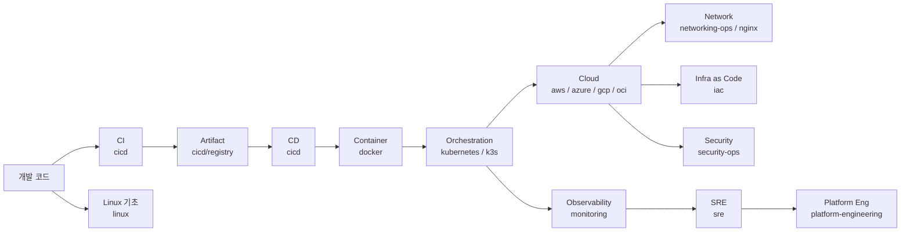
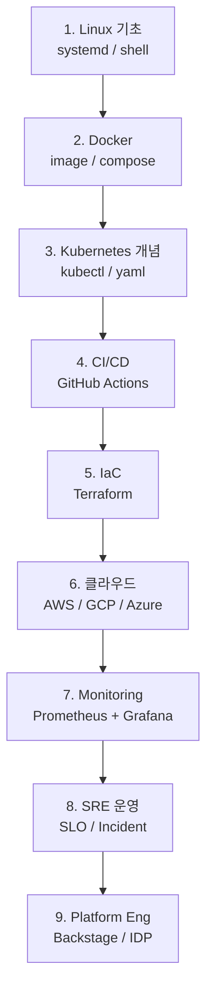

# DevOps Hub — 인프라 운영 / 도구 / 실습

| 문서 버전 | 작성일 | 작성자 | 주요 변경 사항 |
| --- | --- | --- | --- |
| v1.0.0 | 2026-05-15 | engineering-agent/tech-lead | 최초 — 13 영역 통합 hub |
| v1.1.0 | 2026-05-18 | engineering-agent/tech-lead | senior 학습 가이드라인 + mental-model / provider-architecture 노트 link |

**[[../areas|↑ areas]]**

> "이 인프라 / 운영 영역 에 어떤 도구 를 언제 쓰나" — 의사결정 + 실습 통합.

---

## 0. 학습 가이드라인 / 깊이 노트

- [[devops-senior-curriculum]] — 도메인 분류 / competency level / 산출물·검증 매트릭스 (공식 학습 가이드라인)
- [[linux/linux-mental-models-for-devops]] — process / namespace / cgroup / page cache / scheduler
- [[docker/docker-mental-models]] — container = process, layer, OCI, BuildKit
- [[kubernetes/kubernetes-mental-models]] — declarative API, control loop, scheduler, operator
- [[k3s/k3s-when-and-how]] — 적용 시나리오 / 효율 패턴 / 마이그레이션 임계
- [[networking-ops/dns-provider-architecture]] — Cloudflare / Route53 / CoreDNS 의 cascade

---

## 1. 영역 지도

---

## 2. 영역 (13)

### 2.1 Foundation — 기초

| 영역 | 무엇 | 노트 |
| --- | --- | --- |
| [[linux/linux\|linux]] | systemd / network / process / shell | OS 기초 |
| [[docker/docker\|docker]] | 컨테이너 / image / compose | 모든 운영의 토대 |
| [[nginx/nginx\|nginx]] | reverse proxy / LB / TLS | web layer |
| [[networking-ops/networking-ops\|networking-ops]] | DNS / TCP / firewall | 네트워크 운영 |

### 2.2 Orchestration — 오케스트레이션

| 영역 | 무엇 | 노트 |
| --- | --- | --- |
| [[kubernetes/kubernetes\|kubernetes]] | pods / deployments / helm / operators | production cluster |
| [[k3s/k3s\|k3s]] | lightweight k8s | edge / dev |

### 2.3 Cloud — 클라우드 (이미 작성)

| 영역 | 노트 |
| --- | --- |
| [[cloud-aws/cloud-aws\|cloud-aws]] | EC2 / S3 / RDS / Lambda / VPC ... |
| [[cloud-azure/cloud-azure\|cloud-azure]] | VM / AKS / Cosmos / Storage ... |
| [[cloud-gcp/cloud-gcp\|cloud-gcp]] | GCE / GKE / Cloud Run / BigQuery ... |
| [[cloud-oci/cloud-oci\|cloud-oci]] | Instance / OKE / Autonomous DB ... |

### 2.4 Automation — 자동화

| 영역 | 무엇 | 노트 |
| --- | --- | --- |
| [[cicd/cicd\|cicd]] | GitHub Actions / GitLab CI / Jenkins / ArgoCD | CI/CD 도구 비교 |
| [[iac/iac\|iac]] | Terraform / Pulumi / CDK / Ansible | 인프라 코드 |

### 2.5 Operations — 운영

| 영역 | 무엇 | 노트 |
| --- | --- | --- |
| [[monitoring/monitoring\|monitoring]] | Prometheus / Grafana / Loki / Datadog / ELK | 관찰성 |
| [[sre/sre\|sre]] | SLO/SLI / incident / on-call / postmortem | 신뢰성 |
| [[security-ops/security-ops\|security-ops]] | secrets / SIEM / zero trust / compliance | 운영 보안 |
| [[platform-engineering/platform-engineering\|platform-engineering]] | IDP / Backstage / golden paths | 개발자 플랫폼 |

---

## 3. 의사결정 가이드 (한 줄 요약)

| 질문 | 답 |
| --- | --- |
| 단일 서버 / MVP? | docker compose + 1 VM (EC2 / GCE / Compute) |
| 트래픽 늘면? | + ALB / Cloud LB + auto-scaling group |
| 다중 서비스 / 큰 팀? | + Kubernetes (EKS / GKE / AKS) |
| 로컬 dev / edge? | k3s |
| CI/CD 단순? | GitHub Actions |
| CI/CD enterprise? | GitLab CI / Jenkins |
| GitOps CD? | ArgoCD / Flux |
| 인프라 코드 표준? | Terraform |
| 인프라 코드 typed? | Pulumi / CDK |
| 메트릭? | Prometheus (PromQL) |
| 로그? | Loki (lightweight) or ELK (검색) |
| 통합 SaaS? | Datadog / Grafana Cloud |
| trace? | OpenTelemetry + Jaeger / Tempo |
| 시크릿? | Vault / cloud KMS / sealed-secrets |
| reverse proxy? | nginx (legacy) / Traefik / Envoy |

---

## 4. 추천 스택 (스타트업 / SaaS)

| 단계 | 스택 |
| --- | --- |
| **Day 1** (MVP) | EC2 + Docker compose + RDS + S3 + CloudWatch |
| **3개월** | + ECS Fargate or Cloud Run + GitHub Actions + Terraform |
| **1년** | + Kubernetes (EKS/GKE) + ArgoCD + Prometheus + Grafana |
| **3년+** | + Service Mesh (Istio) + Vault + Backstage + Datadog |

---

## 5. 학습 / 실습 순서

---

## 6. 관련

- [[../areas|↑ areas]]
- [[../backend/backend|↗ backend]]
- [[../security/security|↗ security]]
- [[../computer-science/computer-science|↗ CS — networking, OS]]
