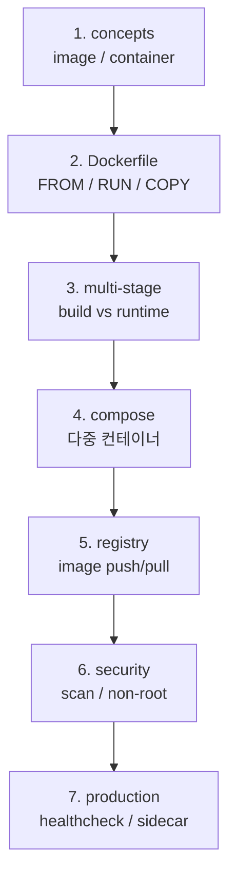

# Docker — 컨테이너 / image / compose hub

| 문서 버전 | 작성일 | 작성자 | 주요 변경 사항 |
| --- | --- | --- | --- |
| v1.0.0 | 2026-05-15 | engineering-agent/tech-lead | 최초 — hub + concepts + 실습 |
| v1.1.0 | 2026-05-18 | engineering-agent/tech-lead | [[docker-mental-models]] 깊이 노트 link |

**[[../devops|↑ devops hub]]**

> 깊이 노트: [[docker-mental-models]] — container = process, layer cache, OCI, BuildKit graph.

---

## 0. 왜 Docker

| 질문 | 답 |
| --- | --- |
| 왜 컨테이너? | "내 PC 에선 됐는데" 사라짐 — image 가 모든 의존성 봉인 |
| 왜 Docker (containerd / podman 아님)? | de facto 표준 + Compose / ecosystem 가장 풍부 |
| 왜 Dockerfile? | 재현 가능 (코드로 image 정의) |
| 왜 multi-stage? | image size 90% 감소 (build / runtime 분리) |

---

## 1. 영역

| 노트 | 내용 |
| --- | --- |
| [[concepts]] | image / container / layer / volume / network |
| [[dockerfile-best-practices]] ★ | multi-stage / cache / layer / non-root |
| [[compose]] | docker-compose 로 다중 컨테이너 |
| [[networking]] | bridge / host / overlay / port |
| [[volume]] | bind / volume / tmpfs |
| [[registry]] | Docker Hub / ECR / GCR / Harbor / GHCR |
| [[security]] | image scan / non-root / readonly / SBOM |
| [[production-patterns]] | sidecar / init container / healthcheck |
| [[pitfalls]] | 흔한 함정 |
| [[practice/practice]] ★ | 실습 (hello-world → spring-boot → full-stack) |

---

## 2. Docker vs 대안

| 도구 | 적용 |
| --- | --- |
| **Docker** ★ | 표준 — 본 vault |
| Podman | rootless / RedHat 환경 |
| containerd | k8s 내부 runtime |
| BuildKit | Dockerfile build 엔진 (Docker 내장) |
| Buildpacks (Paketo / heroku) | Dockerfile 없이 image |
| Nix | reproducible 빌드 (학습곡선 ↑) |

---

## 3. 학습 순서

---

## 4. cheat sheet

| 작업 | 명령 |
| --- | --- |
| image build | `docker build -t myapp:1.0 .` |
| image list | `docker images` |
| container run | `docker run -d -p 8080:8080 myapp:1.0` |
| container list | `docker ps -a` |
| container 안 진입 | `docker exec -it <id> bash` |
| log | `docker logs -f <id>` |
| stop / rm | `docker stop <id> && docker rm <id>` |
| 정리 | `docker system prune -a` |
| compose up | `docker compose up -d` |
| compose log | `docker compose logs -f` |

---

## 5. 관련

- [[../devops|↑ devops]]
- [[../kubernetes/kubernetes|↗ kubernetes (다음 단계)]]
- [[../cicd/cicd|↗ cicd (build + push)]]
