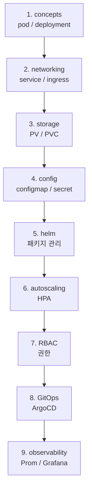

# Kubernetes — orchestration hub

| 문서 버전 | 작성일 | 작성자 | 주요 변경 사항 |
| --- | --- | --- | --- |
| v1.0.0 | 2026-05-15 | engineering-agent/tech-lead | 최초 — hub + concepts + 실습 |
| v1.1.0 | 2026-05-18 | engineering-agent/tech-lead | [[kubernetes-mental-models]] 깊이 노트 link |

**[[../devops|↑ devops]]**

> 깊이 노트: [[kubernetes-mental-models]] — declarative API, control loop, scheduler, operator, admission.

---

## 0. 왜 Kubernetes

| 질문 | 답 |
| --- | --- |
| 왜 k8s? | 단일 노드 (compose) 한도 — 다중 노드 / auto-scaling / self-healing |
| 왜 EKS / GKE / AKS? | control plane 관리 부담 ↓ (vs self-hosted) |
| 왜 k3s? | edge / dev — lightweight (1 binary) |
| 언제 시작? | 다중 서비스 (5+) + 다중 환경 (dev/stage/prod) |

---

## 1. 영역

| 노트 | 내용 |
| --- | --- |
| [[concepts]] | pod / deployment / service / ingress / cm/secret |
| [[deployments]] ★ | rolling / blue-green / canary |
| [[services-networking]] | ClusterIP / NodePort / LoadBalancer + Ingress |
| [[storage]] | PV / PVC / StorageClass |
| [[configmaps-secrets]] | config + secret 관리 |
| [[helm]] ★ | package manager |
| [[ingress-controllers]] | nginx-ingress / Traefik / cert-manager |
| [[autoscaling]] | HPA / VPA / Cluster Autoscaler |
| [[rbac]] | role / role binding |
| [[gitops-argocd]] ★ | ArgoCD / Flux |
| [[managed-vs-self-hosted]] | EKS / GKE / AKS vs kubeadm |
| [[pitfalls]] | 흔한 함정 |
| [[practice/practice]] ★ | 실습 |

---

## 2. k8s 배포판 비교

| 배포판 | 사용 |
| --- | --- |
| **EKS** (AWS) | AWS 통합 |
| **GKE** (GCP) | k8s 발명사 — 가장 빠른 신기능 |
| **AKS** (Azure) | Azure 통합 |
| **OKE** (OCI) | OCI 통합 |
| **k3s** | edge / 단일 노드 |
| **kind** | 로컬 개발 (Docker 안 k8s) |
| **minikube** | 로컬 개발 |
| **kubeadm** | self-hosted control plane |
| **OpenShift** | enterprise (RedHat) |

---

## 3. 학습 순서

---

## 4. cheat sheet

| 작업 | 명령 |
| --- | --- |
| context 전환 | `kubectl config use-context prod` |
| 전체 리소스 | `kubectl get all -A` |
| pod 로그 | `kubectl logs -f pod/web-abc -c container1` |
| pod 안 진입 | `kubectl exec -it pod/web-abc -- bash` |
| port-forward | `kubectl port-forward svc/web 8080:80` |
| describe | `kubectl describe pod/web-abc` |
| apply | `kubectl apply -f manifest.yaml` |
| diff | `kubectl diff -f manifest.yaml` |
| rollout 확인 | `kubectl rollout status deploy/web` |
| rollback | `kubectl rollout undo deploy/web` |
| event 보기 | `kubectl get events --sort-by=.metadata.creationTimestamp` |
| HPA 보기 | `kubectl get hpa` |

---

## 5. 관련

- [[../devops|↑ devops]]
- [[../docker/docker|↗ docker (사전 학습)]]
- [[../k3s/k3s|↗ k3s (경량)]]
- [[../cloud-aws/compute/eks|↗ EKS]] (필요시)
- [[../cicd/cicd|↗ cicd (deploy)]]
