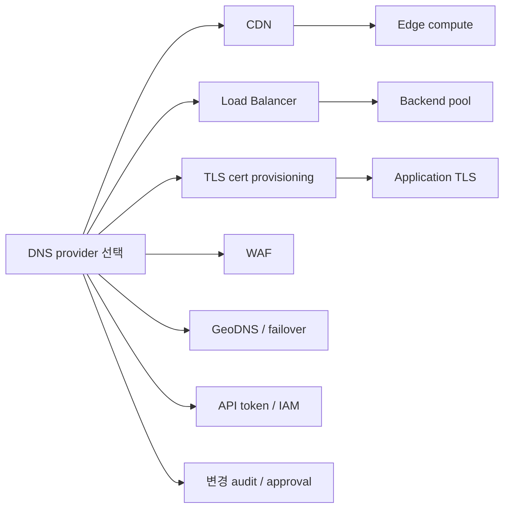

# DNS provider 아키텍처 — Cloudflare / Route53 / CoreDNS / 비교

**[[networking-ops|↑ networking-ops]]**

---

## 1. 목적

본 문서는 DNS provider 선택이 시스템 아키텍처에 미치는 **종속 효과 (cascading effect)** 를 provider 별로 정의한다.

본 문서가 정의하는 것:
- DNS 운영의 3 계층 (registrar / authoritative / recursive) 분리
- 주요 DNS provider 의 기능 매트릭스
- provider 선택이 LB / CDN / TLS / WAF / multi-region 아키텍처에 미치는 cascade
- 운영 결정의 객관적 비교 기준
- 마이그레이션 / 다중 provider 운영의 표준 절차

본 문서가 정의하지 않는 것:
- DNS 프로토콜 / record 종류 — [[dns]]
- TLS / cert 발급 절차 — [[ssl-tls-ops]]
- CDN 의 캐시 정책 — [[cdn]]

---

## 2. 범위

| 구분 | 포함 |
| --- | --- |
| 대상 provider | Cloudflare, AWS Route53, Google Cloud DNS, Azure DNS, NS1, CoreDNS (k8s in-cluster), PowerDNS (self-hosted) |
| 대상 기능 | authoritative DNS, GeoDNS / 라우팅 정책, health check, DNSSEC, private DNS, API / IaC |
| 제외 | recursive resolver (8.8.8.8, 1.1.1.1) — 사용자 측 |
| 제외 | dynamic DNS / DDNS — 가정용 |

---

## 3. 용어

| 용어 | 정의 |
| --- | --- |
| **registrar** | 도메인 소유권 등록자 (GoDaddy / Namecheap / Cloudflare Registrar / Route53 Registrar). |
| **authoritative NS** | 해당 zone 의 record 를 응답하는 권한 있는 server. |
| **recursive resolver** | 사용자가 사용하는 캐싱 resolver (ISP, 8.8.8.8, 1.1.1.1). |
| **zone** | 한 도메인의 record 집합 (`example.com` zone). |
| **delegation** | parent zone (`com`) 이 child zone (`example.com`) 의 NS 를 가리킴. |
| **glue record** | NS 가 zone 자기 자신 안에 있을 때의 IP record. |
| **anycast** | 동일 IP 를 여러 위치에서 advertise 하여 가까운 곳으로 라우팅. |
| **propagation** | record 변경이 전 세계 resolver 에 전파되는 데 걸리는 시간 (실제로는 TTL 만료 후 갱신). |

---

## 4. DNS 운영의 3 계층 분리

DNS 운영은 다음 3 가지 책임을 분리해서 이해해야 한다.

| 계층 | 책임 | provider 예 |
| --- | --- | --- |
| **registrar** | 도메인 등록 / NS 위임 설정 / WHOIS | Cloudflare Registrar, Route53, Namecheap, Gandi |
| **authoritative DNS** | zone 의 record 응답 / 라우팅 정책 / health check | Cloudflare, Route53, NS1, Google Cloud DNS |
| **recursive resolver** | 사용자 측 캐싱 lookup | 1.1.1.1, 8.8.8.8, ISP |

→ registrar 와 authoritative DNS 는 분리 가능하다. 예: registrar 는 Namecheap, authoritative 는 Cloudflare.

→ "메인 DNS 를 무엇으로 가는가" 는 보통 **authoritative DNS** 의 결정을 의미한다.

---

## 5. 주요 provider 기능 매트릭스

### 5.1 기능 비교

| 기능 | Cloudflare | Route53 | Google Cloud DNS | Azure DNS | NS1 | CoreDNS (in-cluster) | PowerDNS (self-hosted) |
| --- | --- | --- | --- | --- | --- | --- | --- |
| anycast | 250+ PoP | 100+ PoP | Google edge | Microsoft edge | 25+ PoP | (per-cluster) | 직접 구성 |
| GeoDNS | ✓ (Enterprise) | ✓ (geolocation / geoproximity) | ✓ | ✓ | ✓ (advanced filter chain) | ✗ | plugin |
| health check 기반 failover | ✓ | ✓ (Route53 health check) | ✗ (LB 로) | ✓ (Traffic Manager) | ✓ (advanced) | ✗ | plugin |
| weighted routing | ✓ | ✓ | ✓ | ✓ | ✓ | ✗ | plugin |
| latency-based routing | ✗ | ✓ | ✓ | ✓ | ✓ | ✗ | ✗ |
| DNSSEC | ✓ | ✓ | ✓ | ✓ | ✓ | ✗ | ✓ |
| apex CNAME (ALIAS) | ✓ (CNAME flattening) | ✓ (Alias to AWS) | ✗ (only A) | ✓ (Alias) | ✓ (ALIAS) | ✗ | ✓ |
| private zone | ✓ (Cloudflare Zero Trust) | ✓ (Route53 Private Hosted Zone) | ✓ | ✓ | ✓ | ✓ (cluster-local) | ✓ |
| IaC (Terraform provider) | ✓ | ✓ | ✓ | ✓ | ✓ | (k8s CRD) | (REST) |
| API rate limit | 1200/5min | 5/sec | 600/min | 다양 | 다양 | (k8s API) | (자체) |
| 통합 CDN | ✓ (자체) | ✗ (CloudFront 별도) | ✗ (Cloud CDN 별도) | ✗ (Azure CDN 별도) | ✗ | ✗ | ✗ |
| 통합 WAF | ✓ (자체) | ✗ (AWS WAF 별도) | ✗ (Cloud Armor 별도) | ✗ | ✗ | ✗ | ✗ |
| 통합 LB | ✗ (Load Balancer 별도) | ✗ (ALB/NLB 별도) | ✗ (LB 별도) | ✗ | ✓ (Pulsar) | (k8s Service) | ✗ |
| 통합 cert | ✓ (Universal SSL 무료) | (ACM 별도) | (Cert Manager 별도) | (Key Vault 별도) | ✗ | (cert-manager) | ✗ |

### 5.2 가격 모델 (2026-05 기준 reference)

| provider | 가격 모델 | 비고 |
| --- | --- | --- |
| Cloudflare | Free (대부분 기능) / Pro $20·월 / Business $200·월 / Enterprise 협상 | DNS 자체는 Free 에서도 무제한 |
| Route53 | hosted zone $0.50/월 + query $0.40/M | query 폭주 시 비용 누적 |
| Google Cloud DNS | zone $0.20/월 + query $0.40/M | Route53 유사 |
| Azure DNS | zone $0.50/월 + query $0.40/M | 동등 |
| NS1 | 사용량 기반 | enterprise 가격 |
| CoreDNS | $0 (self-host) | k8s in-cluster |
| PowerDNS | $0 (self-host) | 운영 인건비 |

→ DNS 비용 자체는 시스템 전체 비용의 0.1% 미만인 경우가 다수. **선택의 비용 영향은 인접 서비스 (CDN / LB / cert) 에서 발생**.

---

## 6. provider 선택의 cascading effect

DNS provider 선택은 인접 7 가지 영역에 종속 결정을 만든다.

### 6.1 cascade 그래프



### 6.2 provider 별 cascade

#### 6.2.1 Cloudflare 메인

| 영역 | 결과 |
| --- | --- |
| CDN | Cloudflare 자체 CDN 자동 (Proxied 토글) |
| LB | Cloudflare Load Balancer (geo / weighted / failover) — 별도 LB 불필요한 경우 다수 |
| TLS | Universal SSL 무료 + edge termination. origin 측 cert 는 self-signed 또는 Origin Cert 사용 가능 |
| WAF | Cloudflare WAF 통합 (자체 룰셋 + managed ruleset) |
| GeoDNS / failover | Load Balancer 의 origin pool + health check |
| API / IaC | Cloudflare Terraform provider + cf-cli + zone-level API token |
| Edge | Workers (V8 isolate) — serverless edge compute |
| 종속 위험 | DNS 와 CDN/WAF/Workers 가 한 vendor 에 묶임 → 마이그레이션 시 동시 이동 비용 |

→ Cloudflare 메인 = "edge 우선" 아키텍처. origin 은 단일 region 으로 단순화하고 edge 에서 다국가 트래픽 / 보안 처리.

#### 6.2.2 Route53 메인

| 영역 | 결과 |
| --- | --- |
| CDN | CloudFront 별도 (Route53 → CloudFront alias) |
| LB | ALB / NLB (Route53 alias record) |
| TLS | ACM (DNS validation 시 Route53 와 자동 통합) |
| WAF | AWS WAF (CloudFront / ALB attach) |
| GeoDNS / failover | Route53 routing policy (geolocation / latency / failover / weighted / multi-value) + Route53 Health Check |
| API / IaC | Terraform AWS provider + IAM 역할 기반 권한 |
| Private DNS | VPC + Route53 Private Hosted Zone (PHZ) — VPC 단위 격리 |
| 종속 위험 | AWS lock-in. multi-cloud 시 Route53 는 origin 만 관리, 다른 cloud 의 record 는 별도 |

→ Route53 메인 = "AWS native" 아키텍처. ACM / ALB / CloudFront / WAF / VPC 의 통합 IAM 이 강점.

#### 6.2.3 Google Cloud DNS 메인

| 영역 | 결과 |
| --- | --- |
| CDN | Cloud CDN (LB 통합) |
| LB | Google Cloud LB (global anycast) |
| TLS | Certificate Manager / Google-managed cert (DNS validation 자동) |
| WAF | Cloud Armor |
| GeoDNS / failover | Cloud DNS routing policy (geo / weighted) + LB 의 health check |
| Private DNS | Cloud DNS private zone (VPC 단위) |
| 종속 위험 | GCP lock-in. 글로벌 LB 는 강력하지만 multi-cloud 회피 어려움 |

#### 6.2.4 Azure DNS 메인

| 영역 | 결과 |
| --- | --- |
| CDN | Azure CDN (Front Door 권장) |
| LB | Azure Front Door (global) / Application Gateway (regional) |
| TLS | App Service Managed Cert / Key Vault Cert |
| WAF | Azure WAF (Front Door / App Gateway) |
| GeoDNS / failover | Traffic Manager (DNS-level) 또는 Front Door (anycast) |
| Private DNS | Private DNS zones (VNet linked) |
| 종속 위험 | Traffic Manager 와 Front Door 의 책임 중복 — 선택 기준 필요 |

#### 6.2.5 NS1 메인

| 영역 | 결과 |
| --- | --- |
| 강점 | filter chain 기반 라우팅 (geo + health + weight + custom JS 결합) |
| 통합 | provider-agnostic (origin 은 어떤 cloud 든) |
| LB | Pulsar (실시간 사용자 측 RUM 데이터 기반 라우팅) |
| 비용 | enterprise 가격 |
| 종속 위험 | DNS provider 자체에 락인 — 비표준 라우팅 룰의 마이그레이션 비용 |

→ NS1 = "multi-cloud + 정밀 라우팅" 아키텍처. CDN / LB / cert 는 자유 선택.

#### 6.2.6 CoreDNS (in-cluster)

| 영역 | 결과 |
| --- | --- |
| 역할 | k8s cluster 내부 service discovery (`<svc>.<ns>.svc.cluster.local`) |
| 외부 DNS | 미담당. 외부 도메인은 별도 authoritative provider 필요 |
| 통합 | k8s Service / Endpoint / ExternalName 자동 |
| plugin | rewrite / forward / cache / hosts / kubernetes / etcd / forward |
| ExternalDNS | k8s Ingress / Service annotation → Cloudflare / Route53 등의 record 자동 동기화 |

→ CoreDNS 는 **외부 provider 의 대체가 아니다**. cluster 내부 전용. 외부와 결합 시 ExternalDNS controller 가 표준 패턴.

#### 6.2.7 PowerDNS (self-hosted)

| 영역 | 결과 |
| --- | --- |
| 적합 | private / on-premise DNS, 통신사 / ISP 환경, 데이터 sovereignty 요구 |
| 부적합 | global anycast 필요 시 (자체 anycast 구성 부담) |
| 운영 | DNSSEC / API / replication 모두 자체 책임 |
| 통합 | API 가 표준화되어 있어 cf-cli 유사 도구 자체 작성 가능 |

---

## 7. 결정 매트릭스 — 시나리오 별 권장

| 시나리오 | 1순위 | 2순위 | 비고 |
| --- | --- | --- | --- |
| 단일 region 웹, edge 보안 / CDN 통합 우선 | Cloudflare | Azure Front Door | DNS + CDN + WAF + cert 한 vendor |
| AWS 단일 cloud, IAM 통합 우선 | Route53 | (없음) | ACM / ALB / VPC PHZ |
| GCP 단일 cloud | Google Cloud DNS | Cloudflare | GCP LB 통합 |
| Azure 단일 cloud | Azure DNS | Cloudflare | Front Door 통합 |
| multi-cloud, 정밀 라우팅 | NS1 | Cloudflare Enterprise | provider-agnostic |
| multi-cloud, 비용 우선 | Cloudflare (DNS) + 각 cloud 별 LB | Route53 + 다른 cloud DNS 분리 | DNS 와 LB / CDN 분리 |
| 사내망 / regulated | PowerDNS | Bind | 외부 anycast 불필요 |
| k8s 내부 service discovery | CoreDNS | (필수) | 외부 DNS 별도 |

---

## 8. 다중 provider 운영의 표준 절차

다음 두 가지 패턴이 표준이다.

### 8.1 패턴 A — primary + secondary NS

| 단계 | 작업 |
| --- | --- |
| 1 | primary provider (예: Route53) 에 zone 생성 |
| 2 | secondary provider (예: Cloudflare) 에 동일 zone 의 secondary 설정 (AXFR / IXFR 또는 API sync) |
| 3 | registrar 에 두 provider 의 NS 모두 등록 (delegation) |
| 4 | recursive resolver 가 둘 중 응답 빠른 쪽 선택 |
| 효과 | 한 provider 장애 시 다른 provider 가 응답. 가용성 ↑ |
| 비용 | 양쪽 모두 zone 비용. record 변경 시 sync 절차 필요 |

### 8.2 패턴 B — 분리 (registrar / authoritative 분리)

| 단계 | 작업 |
| --- | --- |
| 1 | registrar (예: Cloudflare Registrar — markup 없음) |
| 2 | authoritative DNS (예: Route53 — AWS 통합 위해) |
| 효과 | registrar lock-in 회피, authoritative 는 cloud 통합 활용 |
| 비용 | 두 vendor 운영, API token 2 종 |

---

## 9. 운영 결정에 영향을 주는 record 항목

### 9.1 TTL 정책

| record | 권장 TTL | 변경 직전 |
| --- | --- | --- |
| 일반 A/AAAA | 300s (5m) | 60s 로 변경 24h 전 미리 줄이기 |
| MX / TXT | 3600s (1h) | 동일 |
| failover record | 60s | 그대로 |
| apex alias (Cloudflare flattening / Route53 alias) | provider 관리 | (조정 불가) |

→ 변경 직전 TTL 감소는 모든 provider 공통 표준 절차.

### 9.2 CAA record 의 강제력

```
example.com.  CAA 0 issue "letsencrypt.org"
example.com.  CAA 0 issue "amazon.com"
example.com.  CAA 0 issuewild ";"   # wildcard cert 발급 차단
```

→ 위 3 record 가 없으면 임의의 CA 가 example.com 의 cert 발급 가능 (phishing 인프라). 모든 production zone 에 필수.

### 9.3 DNSSEC

| 항목 | 효과 |
| --- | --- |
| zone 의 record 에 서명 | 위조 응답 검출 |
| registrar 에 DS record 등록 | parent zone (`com`) 이 child 의 키 인증 |
| 운영 부담 | 키 rotation 시 DS 갱신 (수동) |

→ 정부 / 금융 / 의료 도메인 권장. 일반 SaaS 에서는 채택률 낮음 (resolver 검증률 낮음).

---

## 10. cert 발급의 cascade

DNS provider 선택이 cert 발급 절차에 영향을 준다.

| provider | 권장 cert 자동화 |
| --- | --- |
| Cloudflare | Universal SSL (무료, 자동) + Origin Cert (origin 측 self-signed 대용) |
| Route53 | ACM (DNS validation 자동, ALB / CloudFront / API GW 무료 attach) |
| Google Cloud DNS | Google-managed cert (LB attach) 또는 cert-manager + ACME |
| Azure DNS | App Service Managed Cert 또는 Key Vault + cert-manager |
| NS1 / 기타 | cert-manager + ACME (Let's Encrypt) + DNS-01 challenge |

→ DNS-01 challenge 사용 시 cert-manager 가 DNS API token 필요. token 권한 범위 = 해당 zone 의 `_acme-challenge.*` TXT record 만으로 제한.

상세: [[ssl-tls-ops]].

---

## 11. 마이그레이션 절차 표준

provider A → B 마이그레이션 시 다음 절차로 무중단 이행한다.

| 단계 | 작업 | 검증 |
| --- | --- | --- |
| 1 | 현재 zone 의 모든 record 를 export (BIND zone file 또는 Terraform import) | record 수 일치 |
| 2 | B 에 zone 생성 + record import | `dig @<B_NS>` 로 모든 record 응답 확인 |
| 3 | A 의 모든 record TTL 을 60s 로 감소 + 변경 propagation 대기 (기존 TTL × 2) | resolver 캐시 만료 |
| 4 | B 의 record TTL 을 60s 로 설정 | (단계 5 의 빠른 rollback 위해) |
| 5 | registrar 에서 NS 를 A → B 로 교체 | `dig <domain> NS @8.8.8.8` 로 B 의 NS 확인 |
| 6 | 24-48h 모니터링 (옛 resolver 의 잔여 query) | A 의 query log 0 수렴 |
| 7 | A 의 zone 삭제 | (충분히 대기 후) |
| 8 | B 의 TTL 을 표준값 (300s 등) 으로 복원 | |

마이그레이션 중 이슈 발생 시 단계 5 직후 rollback (registrar 에서 NS 를 A 로 되돌림) — 단계 3 의 짧은 TTL 이 rollback 시간을 결정.

---

## 12. 흔한 실패 모드

| 실패 | 원인 | 모델로부터의 설명 |
| --- | --- | --- |
| 변경 후 며칠 동안 일부 사용자 옛 IP | TTL 길고 변경 직전 감소 미실시 | §9.1 |
| apex 에 CNAME 설정 시도 실패 | DNS 표준 위반 (NS/SOA 충돌) | provider 별 flattening / alias 사용 |
| Let's Encrypt 발급 거부 | CAA record 가 다른 CA 만 허용 | §9.2 CAA |
| ALB 의 DNS name 이 변경되어 record 불일치 | A record 사용 (alias / CNAME 미사용) | apex alias / CNAME 권장 |
| DDoS 로 origin 노출 | DNS 응답이 origin IP 직접 노출 | CDN / proxy (Cloudflare proxied 토글) |
| cert 자동 갱신 실패 | DNS API token 만료 / 권한 부족 | §10 DNS-01 challenge |
| Cloudflare proxied 모드에서 WebSocket / gRPC 단절 | proxied 모드의 protocol 제한 (Free 계층) | 비proxied (gray cloud) 또는 Spectrum (Enterprise) |
| GeoDNS 가 사내 망에선 의도 어긋남 | resolver 의 EDNS Client Subnet (ECS) 미지원 / 게이트웨이 위치 | ECS 인지 + 라우팅 정책 검증 |
| multi-NS 운영 중 record 불일치 | A 와 B 에 record 차등 변경 | §8.1 sync 절차 |

---

## 13. 참고

- [[networking-ops|↑ networking-ops]]
- [[dns]]
- [[cdn]]
- [[ssl-tls-ops]]
- [[load-balancer-types]]
- [[multi-region-networking]]
- [[waf]]
- [[../kubernetes/services-networking]]
- ExternalDNS — https://github.com/kubernetes-sigs/external-dns
- cert-manager — https://cert-manager.io
- Cloudflare docs — https://developers.cloudflare.com/dns
- Route53 docs — https://docs.aws.amazon.com/Route53
